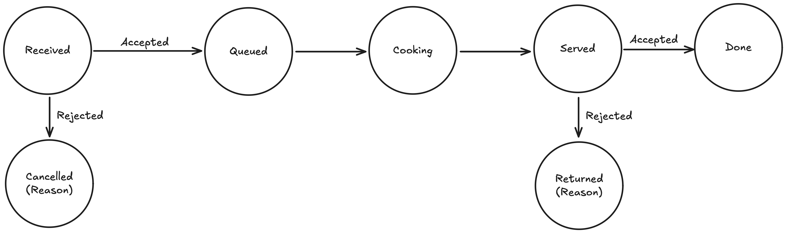
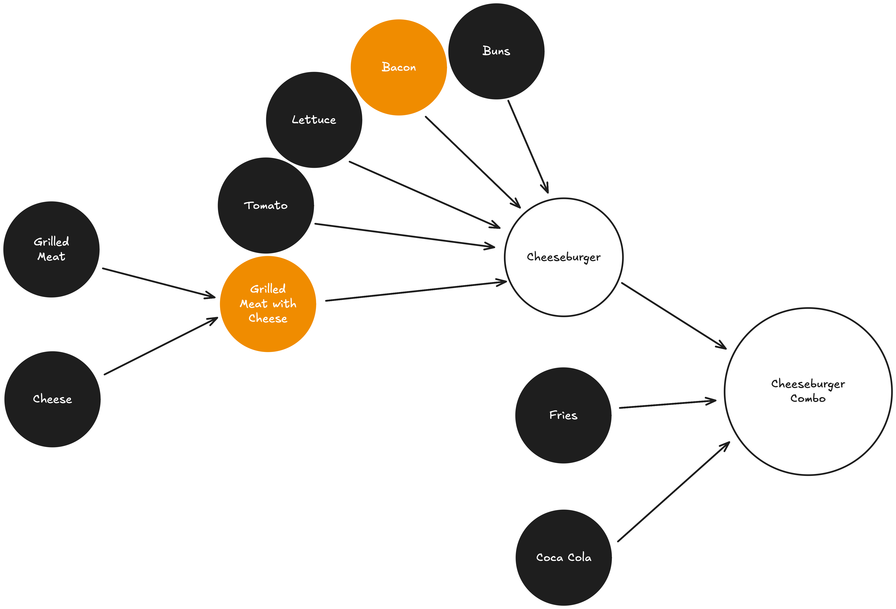

+++
title = "Designing A Digital Restaurant"
date = "2025-10-10"
[taxonomies]
tags = ['software engineering', 'system design']
language = ["en"]
+++

I had the second system design interview of my career last week, the first one was 7 years ago, I was a junior at college, the question was boring, and I fumbled it quite bad.
That just made me scared of system design interviews, so I was pretty nervous, little did I know, it was actually very fun, so I wanted to write about it.

The question, roughly put, is as follows:

> You walk into a restaurant, there's a kiosk. You select some items, maybe a menu with some drinks, and you hit `order`. A few minutes later, you get the order. Assume
> that the kitchen is tracked entirely through a digital system, where individual workers can only communicate through a digital interface, design the kitchen.

As this is a 45 minute interview, there's of course lots of handwaving, but we went through a sequence of discussions I will now describe.

At a very high level, there's a set of states an order will be in.

When an order is taken, the restaurant can accept or reject the order, which will be first queued, then cooked, served, and finally accepted or rejected by the customer.

The simplest idea would to have a one person kitchen, where the kitchen worker has the ability to look at an order, `plan` some series of actions (picking up items, putting items
on counters, grilling, cutting...). Anytime an order is in, the worker receives the order, plans how to cook and serve it, all other orders are queued in the meantime. This, of course,
is completely impractical and not a very useful mental exercise.

A next step, while still keeping a single worker, is to move planning `offline`, where the worker isn't required to do the planning but rather the system deconstructs the order
into pieces and gives the worker a sequence of actions. This is useful because it allows us to later scale the system into multiple workers by centralizing the planning.

There are perhaps multiple mechanisms for doing this, the one I came up with is building a dependency graph for an order, essentially a DAG that represents the preparation of a particular item,
linearize it by topologically sorting the dependency graph and sending each step to the worker in that order. Below is an example DAG for preparing a cheeseburger.

Each item in the graph has a set of prerequisites as well as a set of steps that I hid in the graph. The black circles are the `DONE` items that were completed. The orange circles are `IN PROGRESS`
items that had their prerequisites `DONE`, but their internal set of steps haven't been done yet. The white circles are `WAITING` for their prerequisites to be `DONE`, so their steps can be performed.
You might have realized there's an inefficiency here, maybe some of the internal steps of a particular item only depend on some of its dependencies, so for instance even before having the cheeseburger
ready, the worker can put the fries and the drink in the brown bag, optimizing some of the steps. That is possible to do within this framework by further decomposing circles into smaller circles that
represent each step, so instead of viewing the DAG at the items level, we can see view it at the steps level, getting rid of such inefficiencies.

Once we have offloaded the planning to our digital system, we get to create a job queue that workers can just pick the next job to work on, getting a fair bit of parallelism in the way the kitchen is operated
without any type of coordination between workers. This assumes workers are indistinguishable from each other, meaning any step can be performed by any worker, an assumption far from reality.

To make our scenario a bit more realistic, let's assume that each step is associated with some required capabilities, and that each worker has some capabilities. We can slightly modify our job queue for
giving each worker the next job in the queue that they have the capability to do. Based on the worker distribution, this can approximate a realistic environment. Trivial tasks such as moving item from
the shelf to a counter or from storage to the shelf are capabilities all workers possess, but other tasks such as grilling are more specialized, allowing only certain workers to perform them. A dimension
we currently ignore is that there is a cost to performing operations, and this cost depends on the current circumstances of the worker. If there are 2 available workers at stations A and B, and the next job in
queue is at some other station C, picking which worker will perform the job requires measuring the cost of moving between station A-C or B-C, as well as the next jobs in the queue requiring one of the workers
due to their capabilities.

Instead of handling such complexity, I picked a simpler one where I gave each job a certain amount of time to perform. So grilling meat takes 3 minutes but cutting the lettuce takes 15 seconds. We can also
invent the notion of a time-sensitive task, for instance after grilling a meat it should be served in less than 5 minutes so that it doesn't get cold, or that after 3 minutes it should be taken from the grill
in a minute so that it's not burnt. We can achieve this by making the job queue time-aware, where the time-sensitive tasks are placed based on the timing requirements. We can tag each task with a cost function
based on the time of execution. Aside from hard timing requirements I mentioned before, a basic cost function is just a measure of how much each customer waits. When picking a task, older tasks are more likely
to be picked. Another issue is fairness; if I come in with a 100 unit order, should the next 50 people with smaller orders wait for me, or should I wait for them? My suggestion in the interview was to be
unit-fair, the expected wait time should be proportional to the size of my order. People with small orders should be prioritized over people with large orders, so that one client cannot choke the system.

There are plenty of more complexity to add if you have time, you can design recovery/mitigation schemes in the cases of faulty orders, you can define failsafe mechanisms for synchronizing the real state with
the digital one, because perhaps the worker failed to properly sync the digital system as they worked on their tasks. You can add contention over resources, where instead of having N queues (different work
stations) that are entirely isolated from each other, some resources (perhaps knives or pans) are shared across workers, so we need to remove contention over them.

It is of course important to remember that this is all just a mental exercise, we aren't really designing restaurants, I'm sure anyone who spent more than 10 minutes at a kitchen will laugh at many of the
assumptions I make. The idea is to start from a vague definition with minimal requirements, gradually grow the system into something that resembles the problems we face in computing and software engineering.
I'm glad I got to think about the question, it was a fun 45 minutes, maybe it'll be an inspiration to other companies in how they could design their interview questions, or to candidates on how to think about
system design questions.