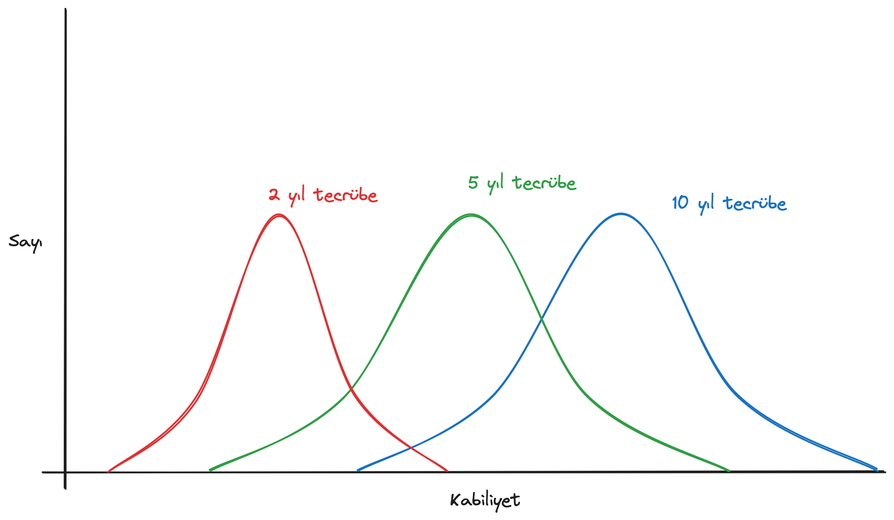

+++
title = "Yazılımda Tecrübenin Anlamsızlığı"
date = "2024-06-28"
[taxonomies]
tags = ['software engineering', 'experience']
language = ["tr"]
+++

<h1 id="yazılımda-tecrübenin-anlamsızlığı">Yazılımda Tecrübenin
    Anlamsızlığı</h1>

Bu yazıyı en başta “Yıllar Geçer, İlanlar Kalır” ismiyle çok daha
    detaylı ve resmi bir dil ile yazmaya başlamıştım, bugünkü modum ona hiç
    uygun olmadığı için daha keskin bir dille sıfırdan yazmaya karar
    verdim.

Öncelikle başlıktaki clickbait’i çözerek giriş yapayım.
    <strong>Anlamsız olan yazılım üzerine kazanılan tecrübe değil, bir
        yazılımcıyı işe alırken X üzerine Y yıl tecrübe beklentisi.</strong>

Nedir peki bunu örnekleri?

<ul>
    <li>“5+ Years experience in at least one of the languages such as Java,
        Go, C#, Scala, Kotlin, Node.js”</li>
    <li>“Bilgi güvenliği, veri güvenliği, siber istihbarat, siber tehdit
        avı, sızma testleri ve zafiyet tespiti gibi alanlarda en az 3 yıl
        deneyimli olmak.”</li>
    <li>“8+ years experiences in software development experience”</li>
    <li>“Java (Java 8+), Spring ve/veya Spring Boot ile en az 7 yıl
        deneyimli”</li>
    <li>“PHP (Laravel, Codeigniter ve/veya Phalcon), Go veya Node.js
        hakkında minimum 4 yıllık iş deneyimi,”</li>
</ul>

Bunların hepsini az önce Türkiye yazılım ekosisteminde aktif rol alan
    şirketlerin açık işe alım ilanlarından aldım. Eminim siz de aynılarını
    ya da benzerlerini sık sık görüyorsunuzdur.

Tabii ki X yıl Y beklentisi sadece iş ilanlarıyla bitmiyor, şirket
    içi pozisyon ve terfilerde de devam ediyor. Bu yazıyı yazmaya karar
    vermemde mesela bir arkadaşıma zam tartışmaları sırasında “sen zaten
    akranlarından çok daha yüksek maaş alıyorsun” gibi bir çıkış
    yapılmasıydı. Bu noktaya kadar okuduysanız aklınızda “bu durum
    Türkiye’ye özel değil” gibi bir itiraz olabilir, haklı da olursunuz. Bu
    konuda eleştiride bulunan ya da durumun değişmesi gerektiğini savunan da
    tek başıma ben değilim zaten, geçtiğimiz ay <a href="remote.com">remote.com</a> da <strong>X yıl tecrübe</strong>
    gerekliliğini iş ilanlarından kaldırdıklarından bahsetti mesela.

Alternatif olarak “Pazarlama giderlerimizi analiz ederek
    verimsizlikleri keşfetme kabiliyetinizi gösterebilmek” gibi yıldan
    bağımsız işe alım kriterleri uygulamaya karar verdiklerini aşağıdaki
    makalede daha detaylı açıklıyorlar ilgisini çekenler için.

<a
        href="https://remote.com/blog/removing-years-of-experience-remote-jobs">https://remote.com/blog/removing-years-of-experience-remote-jobs</a>

Gelelim asıl soruya, <strong>X üzerine Y yıl tecrübe beklentisi neden
        anlamsız?</strong>

Öncelikle, aslında işe aldığımız kişide tecrübe aramadığımızı kabul
    etmek gerekiyor; asıl aradığımız şey kabiliyet, ondan istediğimiz işleri
    yapabilme kabiliyeti. Tecrübe yalnızca bu kabiliyetin kendisini ölçmeye
    çalışmak yerine kullandığımız bir kısa yol.

Sıradaki soru ise şu, tecrübe kabiliyetle ne kadar doğru orantılı?
    Ben bir kişinin tecrübesini ölçtüğümde o kişinin kabiliyetini gerçekten
    ölçebiliyor muyum?

Bu sorunun cevabının hayır olduğunu reddeden birisi varsa, kendisinin
    sebeplerini mümkün olan en kısa zamanda <a href="mailto:hi@alperenkeles.com">hi@alperenkeles.com</a>’a bekliyorum.
    Her şeyden önce tecrübe inanılmaz subjektif, ortak bir tanımı da yok.
    Diyelim ki bir ilan 5 yıl Python tecrübesi istiyor olsun. Aşağıdaki
    sorulara cevaplarınız nedir mesela?

<ul>
    <li>5 yıl * 52 hafta * 5 gün * 8 saat = 10400 saat Python kodu mu yazmış
        olmalı kişi?</li>
    <li>Yoksa 5 yıl boyunca Python ile geliştirme yaptığı bir şirkette mi
        çalışmış olmalı?</li>
    <li>Eğer okulda 3 derste Python kullandıysa bu okul dışında harcaması
        gereken süreyi azaltır mı?</li>
    <li>Eğer kendi lisede Python öğrenmeye başladıysa, üniversitede birkaç
        tane proje yaptıysa bu gereken süreyi azaltır mı?</li>
    <li>Eğer üniversiteden sonra iş bulamadığı bir dönemde kapanıp 6 ay
        boyunca her gün 4 saat Python’da bir proje üzerine çalışmışsa, bu total
        tecrübeye sayılır mı, eğer sayılırsa kaç ay sayılır?</li>
</ul>

Bu sorular yetmiyor gibi, daha temel bir problem de var elde. Bir
    programlama dilini öğrenmek diye bir konsept gerçekte yok, programlama
    dilini değil, o programlama dilini çevreleyen ekosistemi, kütüphaneleri,
    araçları öğreniyoruz aslında. Bu da aynı programlama dilinde 5 yıl
    tecrübeye sahip 2 kişinin aslında birbirinden çok farklı 5 yıllık
    tecrübelere sahip olması anlamına geliyor. Birisi data science ile
    uğraşmış, Pandas/Numpy/Matplotlib ekosistemiyle ilgileniyor, diğeri ise
    tamamen ayrı bir şekilde backend üzerine çalışmış, Django/Flask/Sqlite
    kullanıyor olabilir.

Burada gelebilecek bir itiraza şimdiden cevap vereyim, sonuçta bu
    gördüğümüz ilanlarda pek çok farklı gereksinim var, Backend Software
    Developer alan birisi hem 5 yıl Python tecrübesi isteyecek, hem de belli
    bir miktarda backend tecrübesi isteyecek, dolayısıyla bahsettiğin
    kişilerden Python’un farklı bir tarafında kendini geliştirmiş olanın o
    ilanla alakası yok diyebilirsiniz. Haklı da olursunuz. Bu da bizi
    sonraki probleme getiriyor.

<strong>Bir programlama dilini öğrenmek için yıllarca tecrübeye gerek
        yok.</strong>

Ana akım programlama dillerinin önemli bir özelliği var, neredeyse
    hepsi birbiriyle semantik olarak aynı. Hepsi birbirinden kütüphaneler,
    dizayn sistemleri ve dil yapıları çalıyor. Aynı zamanda bir dildeki bir
    yapı diğerinde yoksa bile, onunla aynı işlevi gören başka bir yapı
    ortaya çıkıyor.

Ne demek istiyorum?

Bugünkü ana akım programlama dillerinde(C++, Java, Javascript,
    Python, Go…):

<ul>
    <li>Imperative Programming: If-then-else, for/while, assignment,
        functions and procedures</li>
    <li>Object Oriented Programming: Classes, Inheritance, Interfaces</li>
    <li>Functional Programming: Higher order functions, Sum Types</li>
    <li>Error handling: Exceptions, algebraic errors</li>
</ul>

Bunların hepsi öyle ya da böyle var. Dolayısıyla pratikte ana akım
    bir programlama dilinde kod yazmaya başlamak genel anlamda diğer
    dillerde tecrübeli bir yazılımcının ihtiyacı olan süre çok fazla değil.
    Tabii ki bu durumun çeşitli istisnaları da var.

<ul>
    <li>Memory Management: Manual(C, Zig), RAII(C++, Rust), Garbage
        Collection(Java, C#)</li>
    <li>Concurrency: Threads, Processes, Async/Await, Channels</li>
    <li>Type System: Static, Dynamic, Strong, Weak, Nominal, Structural</li>
</ul>

Ancak bu spesfik konseptlere hakim olmak geçirilen yıl ile çok
    alakalı değil, daha da ziyade aynı farklı kütüphane ve araçlarda tecrübe
    kazanmak gibi üzerinde çalışılan projelerle alakalı.

Yeni bir dile adapte olmaya şahsi bir örnek vermek gerekirse, geçen
    yıl AWS’de staj yaparken çalıştığım Java projesine kod eklemeye başlamam
    yaklaşık 3 gün sürdü, ve ben profesyonel hayatım boyunca bir kez bile
    Java yazmadım, bu stajdan 3 yıl önce Database dersim için yazmıştım.
    Benzer bir şekilde, üniversite son sınıfta Havelsan’da çalışmaya
    başladığımda daha önce neredeyse hiç Javascript yazmamış olmama rağmen
    4–5 gün içerisinde projeye dokunup kod eklemeye başlamıştım. Tabii buna
    “senin öğrenci ya da yeni mezun olarak yazdığın kod bizim işe alım
    standartlarımızın altında, dolayısıyla 5 yıl tecrübeli birini arıyoruz”
    gibi bir itiraz gelebilir. O itirazı yapacak kişilere de şunu sormak
    isterim.

5 yıl boyunca o kişinin ne yapmasını bekliyorsunuz? Buraya kadar
    gelirken soruyu sıkıştırmaya çalıştığım nokta da buydu. 5 yıl boyunca
    kişi ne yapacak da kod kalitesi yükselecek? 2 farklı şirketteki, 2
    farklı takımdaki, 2 farklı kişideki 5 yıl tecrübe herkes kabul edecektir
    ki aynı değil. Bazı kişiler diğerlerinden daha fazla çalışabilir, daha
    hızlı öğrenebilir, bazı takımlar çalışanları daha iyi eğitebilir, daha
    hızlı gelişmelerini sağlayabilir, bazı şirketler çalışanlara aynı
    projeyi küçücük farklılıklarla tekrar tekrar yazdırıp, bir anlamda
    teknisyen olarak kullanırken, başka şirketler çalışanlarını konfor
    alanlarından çıkarıp çeşitli projelerde farklı problemlerle karşı
    karşıya getirip onlara tecrübe kazandırabilir.

Ki şirkete bile varmadan önce, 2 farklı üniversite mezunu çok farklı
    kabiliyetlerle mezun olabilir. Ya da bir şirket işe alım yaparken
    karşısına bir üniversite mezunu ve alaylı yan yana denk gelebilir. Uzun
    lafın kısası, farklı farklı örneklerle tekrar tekrar anlatmaya
    çalıştığım şey aslında çok basit.

<strong>Tecrübe ölçülebilir standart bir metrik değil, subjektif,
        ihtiyaç duyduğumuz bilgiler ile bize fayda sağlamak yerine daha da zarar
        veriyor.</strong>

Fark ettiyseniz az önce önce iddiamı değiştirdim, daha da ilerlettim.
    Tecrübenin sadece anlamsız değil, aynı zamanda zararlı olduğunu iddia
    ettim şirketler için. Bunun neden olduğunu da konuşalım kısaca. Aşağıya
    sizin için bir 3 adet çan eğrisi çizdim. Kırmızı olan 2 yıl tecrübeli,
    yeşil olan 5 yıl tecrübeli, mavi olan 10 yıl tecrübeli mühendisleri
    gösteriyor.

<figure>
    
    <figcaption aria-hidden="true">Tecrübe Grafiği</figcaption>
</figure>

Yazıda daha önce konuştuğumuz gibi, tecrübe ve kabiliyet arasındaki
    ilişki çok net bir ilişki değil, kişiye ve kişinin kariyer yoluna göre
    çok ciddi değişebilen bir olay. Bu grafiğin realitede böyle olup
    olmadığını tartışabiliriz ayrı bir zamanda, benim şahsi tahminim buna
    yakın bir sonuçla karşılaşma ihtimalimizin yüksek olduğu yönünde her ne
    kadar kabiliyetin bu şekilde bir eğride sıralanabileceğine inanmasam
    da.

Bu grafiğin bize vermeye çalıştığı önemli bir mesaj var aslında:

<strong>Öyle bir p1 ve p2 kişileri mevcuttur ki, 2 yıl tecrübeli p1
        kişisi 5 ya da 10 yıl tecrübeli p2 kişisinden daha yüksek kabiliyete
        sahiptir.</strong>

Tecrübe bazlı alım yapmak şirkete tam olarak burada bahsettiğim 2 yıl
    tecrübeli kişileri kaybettiriyor. O ilana 5 yıl yazdığınız anda, ilana
    yaklaşık 5 yıl tecrübeli ortalama yüzlerce kişiyi çekmiş oluyorsunuz, bu
    noktada 2 yıl tecrübeli kalifiye adayları ilanda tecrübe yazmayan başka
    bir rakibinize kaybetme ihtimaliniz çok yüksek.

E peki nasıl bir alternatif var? Tecrübeyi kullanmayacaksak ne
    yapabiliriz?

Daha önce bu soruyu Twitter’da sorduğumda konu üzerine kafa
    patlatanlardan birisi olan <a href="https://x.com/eserozvataf">Eser
        Özvataf</a> ile yazıda yukarda bahsettiğim remote.com tarzında kişinin
    “X kabiliyetini başarabilme” konusunda kendisini kanıtladığı örnek bir
    proje, bir portföy oluşturması gerektiğini konuşmuştuk. Özellikle aday
    sayısı arttıkça ölçeklenebilme anlamında zorlukları olsa da tecrübe
    kriterinin kendisinin nötr değil zararlı olduğuna ikna olduğumdan
    dolayı, bu alternatifi en mantıklı alternatif olarak görüyorum.
    Bahsettiğim tartışmaları okumak isterseniz aşağıya bıraktım.

<a href="https://x.com/Keleesssss/status/1791535383936634909">Tweet
        Linki</a>

Son bir tavsiye <a href="http://twitter.com/failasaservice/">Fail’den</a>, bu seferki işe
    alım yapanlara değil adaylara. Bir ilanda kaç yıl tecrübe yazarsa
    yazsın, işi yapabileceğinize inanıyorsanız başvurun, bırakın onlar
    reddetsin.
