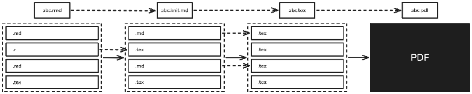
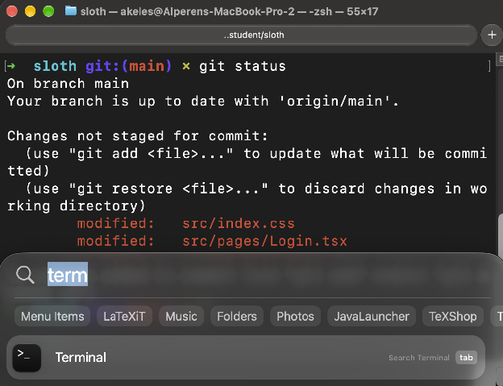

+++
title = "CS 101 for Political Scientists"
date = "2026-09-27"
[taxonomies]
tags = ['computer science', 'ai']
language = ["en"]
+++

These are the lecture notes for the introduction to computer science for political scientists designed for the George Washington University Political Science Department Caucus Workshop on October 6th, 2026\.

The notes are also available as a [web page](/gwu-psc-cs-101/lecture-notes.html), a [PDF](/gwu-psc-cs-101/lecture-notes.pdf) and a [Google Doc](https://docs.google.com/document/d/1srz7aCRNU7tiro41YHXBUllnNjM-iDDtvM4BZ-W7U5A/edit?usp=sharing).

The lecture is phased into 3 parts:

1. **What does your computer do when it takes a `.qmd` or .rmd file and renders a PDF file?**  
   In this part, we will talk about the differences of textual and binary file formats, what is a code editor, document editor, interactive development environment (IDE), document processor, interpreter, compiler, renderer are; what exactly is the workflow of writing a paper is, and how you can optimize it.  
2. **How can you effectively coordinate your edits when working separately but simultaneously? How do you maintain a long-term project with multiple people?**  
   We are used to collaborative document editing on Google Docs or Word Online, but the days of sending **`PaperFinalFinalFinal3.docx`** aren’t that old. We will talk about how to coordinate with both your project-mates and also your past self for projects involving coding, datasets or text formats that don’t have collaborative editing.  
3. **What are the pitfalls and leverage points of using AI in your projects, how can you avoid the pitfalls and use the leverage?**  
   LLMs have significantly democratized programming, many of the quantitative research tasks you perform can become easier with the use of AI models. This usage, however, can lead to subtle errors in your analysis or slow you down at times. We will talk about a set of principles to escape those errors and slowdowns while still getting value out of models.

## What does your computer do when it takes a `.qmd` or `.rmd` file and renders a PDF file?

Our generation has grown up with Microsoft Word, so we are used to a specific document editing style called **WYSIWYG (What You See Is What You Get)** editors. Traditionally, a document was separated into 2 parts, a **description**, and a **presentation**, you as the author would write a document description in a textual format such as [LaTeX](https://www.latex-project.org) or [Markdown](https://www.markdownguide.org/basic-syntax/) (**`.md`**), a **renderer** would take this document and produce a readable or printable version such as a **`.HTML`** file to be viewed in a browser such as Google Chrome or Safari, or a **`.pdf`** file to be printed.

The upside of WYSIWYG editing is that when you are within the use cases that are dreamed up by the creators of the editor, you are golden, everything is easy, nice and smooth until you hit an edge case. Unfortunately for us, classical document editors such as Word were designed for office jobs, and only later retrofitted to be used for academic use cases such as thesis writing. In the last 10 years many of the initial misfits in these designs have been fixed, but you will very potentially encounter one of the following issues with these systems:

- Inability to import, export, properly shape or format citations to your existing citation manager  
- Inability to reformat your document according to the requirements of a new conference or journal  
- Losing track of project checkpoints, inability to reconcile different branches, inability to manage charts, graphs, tables, figures automatically

The fact that these systems are highly [proprietary and closed source](https://en.wikipedia.org/wiki/Proprietary_software) exacerbate these issues, because the community of users cannot fix them. That brings us to our next topic, **file formats and how to use them.**

### File Formats and How to Use Them

You might have heard that computers work by manipulating zeroes and ones under the hood, which is not as accurate as Matrix suggests, but it somewhat makes sense. Conventionally, there are two categories of file formats, **binary formats** and **textual formats**. A binary format is indeed one that uses zeroes and ones to store its contents, for instance PDF is a binary format, you cannot open it in a **text editor** to view its contents, it will show garbled symbols with some occasional textual sub-parts because the smallest unit of a PDF is not a character, it’s a **bit** that is either 0 or 1\.

Binary formats are useful for faster programs that require less space, but they require specialized editors to modify files. Textual formats on the other hand can be opened up in a **text editor** such as TextEdit (the default text editor for Mac), Sublime Text, Visual Studio Code, Obsidian, or even RStudio. The smallest unit of a textual format is a character, so you just open a file and start editing it in your favorite editor.

**Some examples of textual and binary formats for your context:**

- Textual formats  
  - **`.CSV`** (comma separated values)  
  - **`.TSV`** (tab separated values)  
  - **`.TXT`** (Just a plain text file)  
  - **`.RMD`** (R Markdown)  
  - **`.QMD`** (Quarto Markdown)  
  - **`.TEX`** (TeX document)  
  - **`.BIB`** (BibTeX file for references)  
  - **`.R`** (R program)  
  - **`.DO`** (Stata program)  
  - **`.HTML`** (standalone website)  
- Binary formats  
  - **`.DTA`** (tabular dataset format)  
  - **`.PDF`** (Portable Document Format)  
  - **`.DOCX`** (word document)  
  - **`.XLSX`** (excel document)  
  - **`.PPTX`** (powerpoint document)

### What is Markdown, R Markdown, Quarto Markdown?

In the good old days where we didn’t even have the internet, [documents](https://en.wikipedia.org/wiki/Request_for_Comments) were simply **`.txt`** files with some conventions for standardization. As the computer revolution went on to change the world and computer graphics have advanced, we acquired the ability to put those standards into the presentation of those documents. Early HTML pages had the ability to denote [links](https://info.cern.ch/hypertext/WWW/Terms.html#link), [headings, font modifiers](https://info.cern.ch/hypertext/WWW/MarkUp/Tags.html) like bold, italic, underlined. However, HTML is not a great target for writing documents by hand, if you’ve never seen an HTML document, here’s a small snippet from the [world’s first webpage](https://info.cern.ch/hypertext/WWW/TheProject.html).

```html
<TITLE>Tags used in HTML</TITLE>
<NEXTID 22>
<H1>HTML Tags</H1>This is a list of tags used in the <A NAME=0 HREF=MarkUp.html#4>HTML</A> language.  Each tag starts
with a tag opener (a less than sign) and ends with a tag closer (a
greater than sign).   Many tags have corresponding closing tags which
identical except for a slash after the tag opener. (For example, the<A NAME=3 HREF=#2>
TITLE</A> tag).<P>
Some tags take parameters, called attributes. The attributes are given
after the tag, separated by spaces. Certain attributes have an effect
simply by their presence, others are followed by an equals sign and
a value. (See the <A NAME=5 HREF=#4>Anchor</A> tag, for example). The names of tags and
attributes are not case sensitive: they may be in lower, upper, or
mixed case with exactly the same meaning.  (In this document they
are generally represented in upper case.)<P>
Currently HTML documents are transmitted without the normal SGML framing
<H2><A NAME=2>Title</A></H2>The title of a document is given between title tags:
```

Could we do better, well hopefully yes. We need a method for writing documents that are semi-structured, we should be able to just write text for the most part, and only switch to code-like segments when we want to signify specifics like headings or links or tables. We had many languages to solve this problem, two managed to stick to this day to be very popular, LaTeX (**`.tex`**) and Markdown (**`.md`**).

LaTeX is important enough to have its own section, so for now we’ll focus on Markdown. Markdown is relatively new, it was created by [Aaron Swartz](https://en.wikipedia.org/wiki/Aaron_Swartz) and [John Gruber](https://en.wikipedia.org/wiki/John_Gruber) in 2004, compared to LaTeX that was first released by computer scientist Leslie Lamport in 1984\. Markdown is deliberately very simple and approachable, it is designed to be *rendered* similar to a typical Word document, but also to be readable as a text document in a text editor. Headings in Markdown are denoted by hashtags, H1 which is the largest HTML heading is just **`#`**, H2 is **`##`** and so on. You can italicize a text by enclosing it with `*asterisks*`, you can make it bold using `**double asterisks**`, you can combine both via `***triple asterisks***`.

Markdown has built-in tables, the ability to insert figures, footnotes, links. So it allows for most of the basic functionality of a classic Word document without locking into a binary format, however as I said in the beginning, a predesignated set of primitives aren’t enough as we require more complexity. What about double columns or inlined images?  
That’s where the simplicity of Markdown comes into use, we can just extend it, there are hundreds of *Markdown flavors* around, practically every platform that uses Markdown adds their own specific extensions, [even I have one](https://alperenkeles.com/posts/introducing-devy-written-using-devy/)\! The most typical extension is the ability to insert inline **`.tex`** or **`.html`** blocks to handle such cases because they are much more flexible languages.

You have already been using these features in your classes even if you haven’t realized. RStudio is an integrated development environment (IDE) for developing R projects, and it gives you access to R Markdown (**`.rmd)`** and Quarto Markdown (**`.qmd)`** editing and rendering via its editor. The two notable features are the **visual mode** that provides a WYSIWYG-like editing experience without showing you the underlying Markdown constructs, and the inline R blocks that automatically run alongside the rendering process to produce figures or tables. Those figures and tables, if you ever decided to peek inside, are inline **`.tex`** blocks\! Here’s what [`knitr::kable`](https://www.rdocumentation.org/packages/knitr/versions/1.51/topics/kable) inserts into your document when you select [`format = "latex"`](https://pkg.yihui.org/rmarkdown-cookbook/kable#customize-latex-tables)\!  

```latex
% knitr::kable(cars[1:2, ], format = "latex",
%   					   table.envir = "figure")
\begin{figure}
\begin{tabular}{r|r}
\hline
speed & dist\\
\hline
4 & 2\\
\hline
4 & 10\\
\hline
\end{tabular}
\end{figure}
```

The setup is rather ingenious, LaTeX is strictly more expressive than Markdown, so there’s a corresponding  **`.tex`** document for each **`.md`** document. Starting from a **`.rmd`** document, we take the following steps:  
  
The original **`.rmd`** file is composed of several blocks, some of which are executable .r blocks that produce figures and tables and results, some of which are plain Markdown with extensions such as the ability to write references using **`.bib`** files, and some of which are plain LaTeX. The first step takes this file and runs all the executable R blocks to produce a text file mixed with **`.md`** and **`.tex`** blocks. The second step compiles all the .md blocks into **`.tex`** blocks to produce a plain **`.tex`** file that can be compiled to a PDF, which the last step handles. LaTeX can also be compiled to HTML, so RStudio gives you the ability to create website versions of everything you can render onto a PDF.

### Differences Between Integrated Development Environment (IDE), Text Editor, Code Editor, Document Editor, Interpreter, Compiler, Renderer

Typically when people are taught programming, they tend to conflate the multiple different capabilities that their IDE (Integrated Development Environment) gives them. This eventually leads to a type of vendor lock-in, where it is a natural belief that R programs must be written in RStudio, that their paper written in Markdown must be rendered in RStudio, and to finally that anything that cannot be done in RStudio is practically impossible (RStudio being the placeholder for any IDE as well as any general purpose editor such as Word) because they are limited by the options and features provided to them by the IDE. Understanding the lower level components that make your workflows possible gives you the power to overcome the limitations of your current development environment. This section is a brief attempt at giving the reader such information.

Let’s start with the IDE, an IDE is a curation of lower level components required for software development such as a **text editor**, which allows the user to edit any textual format such as changing the header in a CSV, editing the contents of a Markdown or LaTeX paper, modifying programs or scripts in a programming language. A **code editor** typically provides some useful features on top of text editing for reading and editing code such as `syntax highlighting`, go-to-source or documentation for library functions, or autocomplete. A **document editor** is an editor for a specialized format that is designed with better editing knobs such as a tabular editor for CSVs or DTAs or a specialized text editor such as Word. An **interpreter** or a **compiler** are tools for analyzing and executing a programming language such as R, Stata or Python. The interpreter takes an R program, executes it line by line to produce some results. A **renderer** is a tool that takes a document specified in a markup language like Markdown, LaTeX and turns it into a 2D visual document we can give to the readers like HTML or PDF.  
When you write a paper in R Markdown on RStudio, which is your IDE, you use almost all of these tools. The “source” view in Markdown editing is a text/code editor, the “visual” view in Markdown editing is a document editor. When you click the “Execute R block” button or hit “render”, you use the interpreter to produce the graphs or tables you put in your paper, and then the renderer to create the final PDF paper.

Some useful corollaries of this perspective:

- Sometimes there are “limits” of RStudio, such as the inability to view some large datasets. You can just serialize the dataset and use another open source tool to view it without being limited by your IDE.  
- If you are working with a project that has non-R languages, RStudio may not support them, but general code editors like Visual Studio Code supports many languages at the same time, so you can open your R project without any extra hassles and work on it in a different editor if needed in such cases.  
- If you are using AI tools for your projects, RStudio does not have integration with most of them, you can again switch to a different editor in such cases.  
- By default, RStudio does not “cache” the results of your inline R blocks. If your R blocks are taking a long time to execute, you will have to wait for a long time to see the render of your paper for a small edit. Because now you know how the RStudio rendering pipeline works, you can run your R block once, save its result and embed it into your document, absolve yourself of running the same block every time.  
- You may want to tweak small parts of your document in ways Markdown doesn’t easily allow, such as making some parts double columns. You can just keep the first part of the pipeline into producing a **`.tex`** document from a **`.rmd`** file, and manually add the double columning in **`.tex`** after the fact.

### LaTeX

LaTeX stands for Lamport’s TeX, a document language built on top of a document layout engine called TeX by Leslie Lamport. The folk sentiment for LaTeX is interesting; if you get a chance to chat with some computer scientists on the topic, at some point you’ll probably be hearing that it’s terrible as well as it is brilliant. The flexibility of the underlying rendering engine allows for arbitrary types of layouts; you can create new types of glyphs (theoretical computer scientists love inventing these), you can even embed languages inside that does arbitrary computations like the [TikZ language](https://en.wikipedia.org/wiki/PGF/TikZ) for creating vector graphics inside LaTeX documents.

Aside from its expressivity and flexibility, using LaTeX for writing papers has multiple benefits, the first is the ability to decouple the presentation from the content. For instance, you can change all the fonts in the document with a single command. It is very common that when resubmitting a paper rejected from a computer science conference to another, changing the first line that defines the template does most of the work. It also immensely simplifies how you handle references.

The reference format for LaTeX is called [BibTeX](https://www.bibtex.org). A bib entry starts with a marker **`@<bib-type>`** that denotes the type of the entry, followed by an id for in-text citations, followed by a set of key-value pairs enclosed in curly braces to denote the reference metadata as shown below.  

```bibtex
@book{hirschman1970exit,
  title     = {Exit, Voice, and Loyalty: Responses to Decline in Firms,
   Organizations, and States},
  author    = {Hirschman, Albert O.},
  year      = {1970},
  publisher = {Harvard University Press},
  address   = {Cambridge, MA}
}
```

   
Once we have this entry, we can cite Hirschman’s book anywhere in our paper by simply writing **`\cite{hirschman1970exit}`** in **`.tex`**, or **`[@hirschman1970exit]`** in **`.rmd`**.

The whole idea of citation-styles vanishes in this setting, because a simple toggle allows us to set the style for both in-text and end-text citations, see the MLA example below:  

```latex
\usepackage[style=mla, backend=biber]{biblatex}
```

Let’s say you wanna switch to APA?  

```latex
\usepackage[style=apa, backend=biber]{biblatex}
```

## How can you effectively coordinate your edits when working separately but simultaneously? How do you maintain a long-term project with multiple people?

Computer science has a subfield called “distributed computing”, the study of writing programs that require coordination of multiple computers. Each time you use the internet, you are actually talking to a remote server far away from you, a two-person distributed system behind the scenes, so those programs need to somehow coordinate with each other.

When you use the real-time collaborative editing feature on Google Docs, there’s a coordinator between you and your collaborator that manages your edits. Imagine if two people are talking at the same time, a listener might just hear garbage instead of the individual sentences. Google essentially runs a coordinator between you and your collaborator that “linearizes” your edits so that seemingly concurrent edits happen right after one another to produce something acceptable.

The issue, of course, is that (1) such a coordinator is no doubt expensive to run, and more importantly (2) the assumption that both parties always have access to stable internet connections is very generous. Hence, computer scientists have developed what we call “distributed version control”, a technique that allows us to collaborate edits in our programs even though we do not receive every update our teammates do at every second without the need for a centralized coordinator. Although multiple technologies have existed and exist, the most popular one is called [“git”](https://git-scm.com). On top of this technology, there are multiple online code storage services almost all of which are free, the most popular is called [“Github”](https://github.com).

Version control solves three important problems. The first is versioning, solving the **`PaperFinalFinalFinal3.docx`** problem. Git has the concept of a “commit”, essentially a simple checkpoint that you can travel back to if needed. Especially as your projects evolve, you will feel the need to clean up, delete content, change functionality. Many times, you will hesitate removals or changes, duplicating existing content just to make sure it’s still accessible. The commits allow you to retain each checkpoint state available while keeping your current working tree clean.

The second is branching, solving the **`PaperFinalCopy.docx`** problem. It is typical that you will spin-off small experiments out of your main workflow, start from an existing checkpoint but go through a different path. Typically, you will copy your existing state, copy everything into a new folder, and start working there. The problem is that now you don’t have 2 versions of a project, you have 2 projects that you have to separately maintain. If you need to reconcile those branches, good luck\!

The third is offline collaboration, solving the **`PaperMergedMugeBraydenBedirhanEdits.docx`** problem. Each collaborator’s change has to be relayed back to your local project, concurrent edits are insanely painful because you are responsible for the reconciliation, that you haven’t forgotten any change your collaborator made, that you didn’t mismerge. Git has a built in “merge” functionality that takes 2 edits starting from a common source, automatically merges changes to the unrelated parts of the file, allows you to interactively edit the parts that are ambiguous or perhaps concurrently edited, this is the big one\!

For pure document editing, you will most likely find an online collaborative editing tool, **`.tex`** has Overleaf, **`.docx`** has Google Docs and Word Online, I’m pretty sure you can collaboratively edit **`.md`** via many different tools. However, your R or Python programs, your **`.dta`** or **`.csv`** datasets, your figures and tables don’t have these types of tools; you will either go back to the old ways of copying and sending files with lots of potential for error, or you will learn to love Git.

Now, let’s memorize some commands\! Lucky for you, LLMs have removed lots of complexity here, but it’s still good to know the fundamentals. The next page is a simple introduction to Git commands **`init, status, add, commit, pull, push`** in case you wanna print and hang it.

#### Everyday Git

Git works by keeping track of changes inside a **repository**, which is simply a folder whose history Git remembers. You usually interact with Git through a terminal. You do not need to memorize dozens of commands; for everyday research projects, a handful will get you surprisingly far.

To turn your current project folder into a Git repository:

```
git init
```

Before doing anything else, you can always ask Git what is going on:

```
git status
```

After editing some files, you first tell Git which changes you want to include in your next checkpoint:

```
git add paper.qmd
```

or, to add all currently changed files:

```
git add .
```

Then create the checkpoint, called a **commit**, with a short description:

```
git commit -m "Add turnout data"
```

So your basic workflow is simply:

```
git status
git add .
git commit -m "Describe changes"
```

If you are collaborating through GitHub, there are two additional commands you will use frequently. **Pull** downloads changes made by your collaborators and merges them into your local project:

```
git pull
```

**Push** uploads your commits to GitHub:

```
git push
```

A good collaborative workflow is therefore:

```
git pull
# edit your files
git status
git add .
git commit -m "Update models"
git push
```

The suggestion therefore is; always use Git and Github for all your projects that involve any type of programming.

In terms of collaborating on a paper, it depends a bit on your workflow. Typically, when we are writing papers we use a Git \+ “lock” mechanism over a group chat. When I’m working on a specific section I acquire a lock, write my piece, release the lock, which means my collaborators don’t touch that specific part of the paper to not produce “merge conflicts”. A merge conflict is when 2 new edits on a common commit clash with each other, perhaps we’ve fixed the same sentence at the same time but in slightly different ways, Git has no way of knowing our original intention, so it tells us that we have to resolve the final version.

If you are working on a paper that wouldn’t be a good fit for the informal locking mechanism I described, I would advise using Overleaf for Latex as it allows for online realtime collaborative editing.

Lastly, in the previous page I’ve given you a one-pager on Git “commands”, but what are they, how and where do you use them? 

### The Terminal

  
**Remember the Matrix.**  
A terminal is a way to interact with your machine; many of the functionalities that are available to you over a GUI (Graphic User Interface) by browsing, hovering and clicking using a mouse are available over a TUI (Terminal User Interface) in your terminal you can open through typing “term” in Mac’s spotlight via `cmd+space`.



Navigating your computer through the terminal has thousands of use cases, but you essentially need to know two things on top of the Git commands I provided in the previous page:

1. **`ls`** `– list directory contents`  
2. **`cd`** `- change directory`

The next page is a similar one-pager for navigating using **`ls`** and **`cd`**\!

#### Moving around with `ls` and `cd`

Let’s say that you start from a folder with three sub-folders:

```
project/
├── data/
├── figures/
└── paper/
```

First, see what is inside the current folder:

```
ls
```

Output:

```
data    figures    paper
```

Move into the data folder:

```
cd data
```

See what is inside:

```
ls
```

Output:

```
survey.csv    countries.csv
```

To go **back one folder**:

```
cd ..
```

Now move into paper:

```
cd paper
```

and list its contents:

```
ls
```

Output:

```
paper.qmd    references.bib
```

So, in practice, navigating around often looks like:

```
ls
cd data
ls
cd ..
cd paper
ls
```

## What are the pitfalls and leverage points of using AI in your projects, how can you avoid the pitfalls and use the leverage?

Large Language Models (LLMs) have significantly changed the practice of programming. Programming is essentially the process of taking informal thoughts and intents and formalizing them into a language the machine can execute. Today an LLM can take an informally stated intent—a prompt—and produce a program that is one possible interpretation or formalization.

The core tension is then the verification of this formalization, because the machine might “hallucinate”, “misunderstand” or “mis-infer” the original stated intent because of a variety of reasons, maybe we have used the wrong wording, maybe we mis-specified, and at some point due to the fact that these systems are statistical inference machines, so such inference just cannot generalize to every single possible task. It is important to understand that although anthropomorphization as I have at the beginning of this paragraph is commonplace, these tools are not simply digital minds, the training process of a language model does not train a digital human, it produces a somewhat “jagged intelligence”, one that can produce hundreds of pages of novel mathematical proofs but makes completely bogus assumptions about simple regression models.

The question therefore is, are these tools useful, in what types of tasks or which domains, and how so? What types of leverages do they produce for their users? The answer I’ve personally come up with is that [the gap between the specification and the task itself](https://alperenkeles.com/posts/specifiability-is-the-leverage/), and [the ease of verifying the result against producing the work](https://alperenkeles.com/posts/verifiability-is-the-limit/) are the main considerations.

Sometimes these leverages show up at small tasks like removing the syntax barrier when programming. When running a quantitative analysis in R, you can ask a model to write you a complex transformation for a dataset; which you would need to manually spend going through library documentations to find out the exact “chant”, however you can very easily read the filter and verify that the transformation indeed produces what you expected. Some other times leverages show up at larger search tasks, where the search itself is potentially unbounded but the result is small and easily verifiable, similar to the classical advantage of Google search over encyclopedia. If you are looking for a particular fact like the turnout data for off-cycle governor elections, the search itself will take a much longer time compared to verifying the individual web-pages and data you get from the model. In general, source-aware search is incredibly powerful because lots of times search processes require lots of side and backtracks, but the result is obvious in hindsight. An important caveat here is that although you reach the same “results”, the externalities are different. When doing the search yourself, you learn facts outside of the core result you were initially searching for, the model-based search means you lose those facts. As researchers, our job is not to merely obtain results but to learn to ask the right questions, so over-indexing on singular results is unlikely to be a good long-term career strategy.

Another good use-case is translation. Typically, translations between programming languages or data formats are non-trivial with deterministic procedural algorithms because of the small quirks and nuances between the two sides. Models are very good at such translations, and the translation itself is pretty verifiable. So for instance if you have a PDF document that you want the raw text from, you can just ask a model and verify its output after the fact. If you want to take an existing Word document and turn it into Latex, you can just ask, verify, refine if needed, and get a working Latex document with minimal manual intervention. If there is an existing library in Python with a specific data analysis method you need to use for your research, you can ask a model to produce an identical R version and test their equivalence against each other, and you can successfully reach an identical R library pretty easily.

The last use case I want to talk about is using the model as a critique, a potential devil’s advocate you need to defend against, a tireless editor for fixing your grammar mistakes, an avid code reviewer for finding possible bugs and mistakes in your code and analysis. LLMs are much better editors and critics and reviewers than they are writers or programmers or researchers.

The obvious pitfall in all of these use-cases is losing your understanding, and the fatigue of [being a reverse-centaur](https://pluralistic.net/2025/12/05/pop-that-bubble/#u-washington). The output of research is never the product, but almost always the understanding we get from it. Building a dataset is not useful if we don’t understand how to use it, or why we built it, why the particular columns are arranged as they are, what the particular missing points in the dataset are, what questions we can answer with it… The companies producing these models would be ever more happy on our dependence, having a researcher say they cannot do their work without this technology is the largest leverage any technology creator can have. The point therefore is to [never become a meat-proxy](https://gruhn.me/blog/2026-08-03/), but always to figure out how to position yourself around the growing capabilities of a new technology that all of us are still trying to understand.
