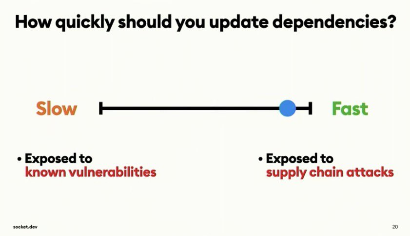

+++
title = "How can we secure Package Managers?"
date = "2025-09-18"
[taxonomies]
tags = ['software engineering', 'security']
language = ["en"]
+++

Package managers, however prevalent, feel as if they are still infants in terms of security, considering the various
supply chain attacks we have seen in the previous few years. The few solutions I see as a response are (1) securing the
producers of the packages via account security practices such as multi-factor authentication, (2) advocating against using
external packages for convenience by sometimes [not having a package manager](https://www.gingerbill.org/article/2025/09/08/package-managers-are-evil/), or [making it harder to create packages](https://x.com/mitchellh/status/1965409636024221901), and (3)
which feels to me is a sensible direction, is reducing the attack surface by adding [a delay in consumptions of the package updates](https://pnpm.io/blog/releases/10.16), hence securing *some* of the consumers, because if all users used the same delay, we probably would have ended up in similar scenarios, albeit a bit safer. This option also has the problem of not taking into account when you need imminent updates specifically because you need to escape from a known vulnerability.

I argue that even though the idea of securing the consumers instead of making it harder to create or consume packages, or securing the producers
is the right direction, time is not the right axis, it's a faulty proxy. When we wait a day for updating a package, we trust the social process
that is supposed to execute within those 1440 minutes, which is the results of the package audits, user reports, perhaps the account owner that got exploited in the first place realizes the issue. **As our trust in time is a reflection of our trust in the social process, why not just codify our trust in the social process in the first place?**

I propose a HITS like graph ranking algorithm that users can define trust metrics based on the characteristics of the diffusion of the
package. Users should be able to set queries like `only if 60% of the users updated the package, I want to update too`, or `only if users X and Y updated the package, I want to update too`. This allows for the package auditers to be a central part of the package management, because users can
now use them as package authorities in their queries. The caveat, of course, is that the package management is now a complex system with a 
distributed state, which can have bugs of its own, in addition to opening up a whole lot of different questions such as the trustworthiness of the 
user-provided metrics, which is why I think an authoritative approach of assigning users some measure of trustworthiness is a useful addition.

Though I don't have a good background in this domain, I found the idea to be stupidly simple while it has the potential to be very effective, 
which means I might actually be catastrophically wrong. I wanted to keep the idea in some long living form, which is why this blog post exists. If 
you have some criticisms, I would love to hear them ([akeles@umd.edu](mailto:akeles@umd.edu)).
