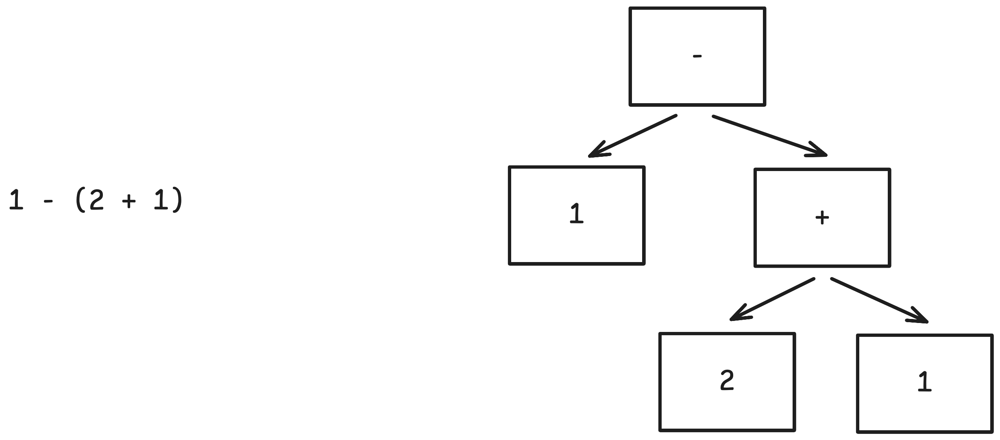

+++
title = "Programlama Dilleri Hakkında"
date = "2025-09-04"
[taxonomies]
tags = ['programming languages']
language = ["tr"]
+++

Programlama dilleri, programcı ile bilgisayar arasındak.en temel iletişim kanalı. Yazdığımız programlar derleyiciler (compilers) ve yorumlayıcılar (interpreters) ile bilgisayarların onları çalıştırabileceği formlara dönüşüyor, sonrasında ise kullanıcılar yazdığımız programları kullanabilir hale geliyor. Her ne kadar günümüzün büyük bir kısmını bilgisayara istediklerimizi yaptırabilmek için programlama dillerini kullanarak geçirsek de, programlama dillerinin hem teorisini hem de pratiğini anlamak programcılar için bir beklentiden ziyade bir anomali, nadide bir uzmanlık. Bunun popüler kültürde yansımalarını görmek çok kolay;

- Bir programlama dilini öğrenince diğerlerinin yalnız sözdizimini (syntax) öğrenerek onları yazabileceği inancı.
- JavaScript'in gariplikleriyle ilgili şakalar
- Python'ın `in`, `is` gibi İngilizce kelimeleri kullandığı için daha basit ya da kolay olduğu iddiası.

Yazının kalanında programlama dillerinin yerleştirildiği bu mistik, anlaşılmaz noktadan onları biraz da olsa çıkarabilmek için kendi gözümden programlama dillerini nasıl değerlendirdiğimi, farklı dillerin nasıl özelliklere sahip olduğunu, ana akımın dışına çıktığımızda programlama dillerinin nasıl farklılaşabildiğini anlatmak istiyorum. Bu yazı bir nevi geçtiğimiz yıl yazdığım [Tip Sistemleri Hakkında](/posts/tip-sistemleri-hakkinda) yazısının bir devamı, bütünleyicisi olacak, o yüzden eğer bu yazı ilginizi çekiyorsa onu da okumanızı tavsiye ederim.

## Programlama Dili Nedir

Benim gözümde programlama dilleri, en temelde sözdizimi (syntax) ve anlamı (semantics) olarak iki teorik bileşenden oluşuyor, bu bileşenlerin üzerine bir pratik implementasyon (derleyici ya da yorumlayıcı), bir takım araçlar (Dil Sunucusu - LSP, Kod Formatlayıcı, Paket Yöneticisi, Paket Kayıt Sistemi), ve bir kütüphane ekosistemi ile en başta matematiksel bir obje olan programlama dilleri sosyal objelere dönüşüyor. Bu yazıda programlama dillerine mümkün olduğunca matematiksel bir obje olarak yaklaşacağım, yalnızca yer yer dilin tasarımındaki belli özelliklerin implementasyonu, araçları ya da ekosistemi nasıl etkilediğini tartışacağım.

### Sözdizimi - Syntax (Sentaks)

İlk paragrafta programlama dillerinin programcı ve bilgisayar arasındaki iletişimi sağlayan kanal olduğundan bahsetmiştim, burada bir köprüye ihtiyacımız var, bu köprü de sözdizimi. Bir dilin sözdizimi o dilin metinsel halini tanımlıyor, yani teknik olarak aynı dil için dilin anlamını değiştirmeden farklı farklı sözdizimleri kullanmak mümkün. Bunun en iyi örneklerinden birisi programlama dillerindeki makrolar. Makrolar bize dilin ifade edemediği ya da sahip olmadığı sözdizimlerini ifade etme imkanı sağlıyor. Bunun en basit örneklerinden birisini C makroları ile görüyoruz, üzücü ki pek çok programcının makrolarla etkileşimi bunları hiçbir zaman geçmiyor. Gelin küçük bir örnek verelim, C programlama dilinde biliyorsunuz ki çok tiplilik yok, bu da demek oluyor ki Java ya da C++'da yazabildiğiniz gibi `Vector<String>` gibi bir ifade yazamıyorsunuz, bu problemi çözmenin bir yolu C tip sistemini yoksaymak, bunun için koleksiyonunuzun elemanlarının tipini `void*` olarak tanımlıyorsunuz, kullanıcı hangi tip değerleri koleksiyona koyduğundan kendisi sorumlu. Benzer bir problemi makrolar kullanarak da çözebiliyorsunuz. Aşağıdaki örnekte `DEFINE_VECTOR` makrosu bir anlamda sizin dilin sözdizimsel limitlerini aşmanıza izin veriyor, dili büyütmenizi sağlıyor.

```C
// Define a type-safe vector for any element type
#define DEFINE_VECTOR(T, Name)                                      \
typedef struct { T *data; size_t len, cap; } Name;                  \
static inline void Name##_init(Name *v){ v->data=NULL; v->len=v->cap=0; } \
static inline void Name##_push(Name *v, T x){                        \
    if(v->len==v->cap){ v->cap=v->cap? v->cap*2:4;                   \
        v->data=realloc(v->data, v->cap*sizeof(T)); }               \
    v->data[v->len++]=x;                                            \
}                                                                   \
static inline void Name##_free(Name *v){ free(v->data); }

// Example: make IntVec and StrVec
DEFINE_VECTOR(int, IntVec)
DEFINE_VECTOR(char*, StrVec)

int main(void){
    IntVec iv; IntVec_init(&iv);
    for(int i=0;i<5;i++) IntVec_push(&iv, i*i);
    for(size_t i=0;i<iv.len;i++) printf("%d\n", iv.data[i]);
    IntVec_free(&iv);

    StrVec sv; StrVec_init(&sv);
    StrVec_push(&sv, "hello"); StrVec_push(&sv, "world");
    for(size_t i=0;i<sv.len;i++) printf("%s\n", sv.data[i]);
    StrVec_free(&sv);
}
```

C makroları farklı dillerdeki makro ailelerine göre güçsüz ve güvensiz bir makro tipi. LISP makroları size neredeyse sıfırdan yeni bir dil tasarlama fırsatı veriyor, LISP dil ailesinden çıkmış "Dil Odaklı Programlama" mottosunu temel alan Racket ile farklı problemler için farklı "diller" yazabiliyorsunuz, ancak aslında hepsi Racket makroları ile yazılmış sözdizimleri, yani aslında alttaki dilin semantikleri hala Racket, hatta son 2 yılda yayınlanan Racket ile yazılmış ama sözdizimi neredeyse tamamen Python'ı andıran Rhombus adında bir "dil" de mevcut.

Sözdiziminin önemi bir dilde kodu doğru yazdığınızda değil, yanlış yazdığınızda daha çok ortaya çıkıyor. İyi tasarlanmış bir sözdizimi alacağınız hataların lokalize olmasına önem verir, eğer ki siz 17. satırda yaptığınız bir yazım hatası için 42. satırda hata alıyorsanız, programlama dili sözdizimi anlamında size ihanet etmiş demektir. Benzer şekilde programlama dilinin sizin yaptığınız hataları sessizce yok etmesi de sözdizimsel bir hata, bunun en iyi örneklerinden birisi JavaScript'teki ASI (Automatic Semicolon Insertion):

```js
function getObject() {
  return
  {
    value: 42
  }
}

console.log(getObject());
// undefined
```

ASI JavaScript'in sözdizim dizaynının bir parçası, eklenebilecek herhangi bir ifadenin sonuna noktalı virgül (`;`) ekleyerek dili yeni başlayanlara daha yakın hale getirme çabasının bir sonucu, ve benim gözümde kötü bir dizaynın iyi bir örneği. Dilin sözdiziminin parçası olan başka örnekler Python'ın tarihsel olarak popüler olan kıvırcık parantez (`{}`) blok sözdizimini reddedip girinti (indentation) bazlı bloklar oluşturması, ki daha geçmişe baktığımızda kıvırcık parantez öncesi `BEGIN END`, `IF FI`, `FOR ENDFOR` gibi farklı sözdizimsel tercihler de görüyoruz. Tabii en ünlü sözdizimsel tercih, bu tarz bloklar, işaretçiler, operatör öncelikleri vb. gibi tercihleri bir kenara bırakıp S-ifadeleri (s-expressions) kullanmak, LISP dil ailesini s-ifadeleriyle dolu bol parantezli kodlarından tanıyabiliyoruz.

```lisp
(progn
  (defmacro thr (x &rest fs) `(reduce (lambda (a f) (funcall f a)) ',fs :initial-value ,x))
  (labels ((fib (n) (if (< n 2) n (+ (fib (- n 1)) (fib (- n 2))))))
    (let* ((xs '(1 2 3 4))
           (ys (mapcar (lambda (x) ((lambda (k) (+ (* x x) k)) 7)) xs))
           (sum (reduce #'+ (remove-if-not #'evenp ys)))
           (t3 (thr 3 (lambda (x) (+ x 5)) (lambda (x) (* x 2)))))
      (format t "~&YS=~a SUM=~a FIB(10)=~a THR=~a~%" ys sum (fib 10) t3))))
```

Her ne kadar bu şekilde görmesek de, sözdizimini bir kenara bırakmanın bir başka örneğini devops ailesinde `JSON` veya `YAML` bazlı sözdizimlerinin popüler olmasında görüyoruz. Github aksiyonlarınızı yazdığınız YAML dosyası aslında bir programlama dili.

Aynı dilin semantik olarak değişmeyen ancak sözdizimsel olarak değişen 2 halinden bahsediyorsak, o zaman popüler "programlama dili fark etmez, sözdizimini öğrenince hepsi aynı zaten" algısı doğru olabilir, ancak ben o halde bile doğru olduğunu düşünmüyorum, çünkü sözdizimi bizim için dilin bazı parçalarını kullanmayı daha kolay, bazı parçalarını kullanmayı daha zor hale getiriyor, eğer dilde bir veri yapısı için özel sözdizimi varsa, programcıların onu kullanma ihtimali çok daha artıyor. Python ve JavaScript'in ikisi de sonradan üstüne eklenmiş statik tip sistemlerine sahip, ancak TypeScript MyPy'dan çok daha popüler, benim bu konudaki görüşüm TypeScript tiplerinin yazmanın sözdizimsel olarak Python tip tüyolarından (type hints) çok daha kolay olması. JavaScript'te çok benzer kullanım şeklillerine sahip olmalarına rağmen objelerin Map'e göre çok daha popüler olduğunu görüyoruz, çünkü obje oluşturmak için özel sözdizimi varken, ve bu dilin çok temeline yerleşmişken, Map fonksiyonlarının dilde yazılmış farklı bir veri yapısından bir farkı yok. Sözdizimi dile olan sosyal algımızı etkiliyor, bu da sonrasında sosyal bir obje olan programlama dilini değiştiriyor, ekosistemi, araçları, dilin kullanımını ve gelişimini yönlendiriyor.

## Semantik - Semantics (Anlambilim)

Programlamanın bilgisayar ve programcı arasındaki iletişim olduğunu söylemiştik, sözdizim bu iletişimin "nasıl" olduğunu belirliyorsa, semantik de bu iletişimin ne anlama geldiğini belirliyor. Bunu daha derin anlatmak için biraz matematiğe girmemiz gerekecek, onun için kemerlerinizi bağlayın, koltuklarınıza sıkı tutunun. Programlama dillerini yorumlarken, kullanıcıdan bir metin olarak gelen kodu dilin sözdizimine uygun bir şekilde ayrıştırıyoruz (parsing). Bu ayrıştırmanın sonunda elimizde dilin soyut bir temsili ortaya çkıyor, bu temsile "Soyut Sözdizim Ağacı" (Abstract Syntax Tree) diyoruz.

Bu noktadan itibaren [diller arasındaki semantik farklılıklardan](#evaluation-strategies) bahsetmeden önce küçük bir teorik sapma yapacağım, dil semantiklerinin formal olarak nasıl tanımlandığını [UMASS Amherst Programlama Dilleri](https://people.cs.umass.edu/~arjun/courses/cmpsci631-spring2016/reading/lecture2.pdf) dersinden aldığım bir örnekle açıklayacağım. Eğer matematiksel notasyonlardan sıkılıyorsanız, korkuyorsanız, ya da ilgilenmiyorsanız önümüzdeki kısmı atlayabilirsiniz.

Dilimiz aritmetik ve ikili (boolean) ifadeler içeren basit bir hesaplama dili. Dilin yapısını ifade etmek için EBNF (Extended Backus Naur Form) kullanıyoruz.


```ebnf
e ::= true | false | n | e1 + e2 | e1 * e2 | e1 > e2 | if e1 then e2 else e3 | (e)
v ::= true | false | n
```

Aynı tanımı TypeScript'te yapmak istersek

```ts
type Expr = 
    | { t: "Number", n: number         }
    | { t: "Bool", b: boolean          }
    | { t: "Add", lhs: Expr, rhs: Expr }
    | { t: "Mul", lhs: Expr, rhs: Expr }
    | { t: "Gt",  lhs: Expr, rhs: Expr }
    | { t: "If", b: Expr, then: Expr, else: Expr }
type Value =
    | { t: "Number", n: number         }
    | { t: "Bool", b: boolean          }
```

Programcının sözdizimine uyarak metinsel olarak ifade ettiği programları ayrıştırma (parsing) ile soyut sözdizim ağaçlarına çeviriyoruz. Aşağıda bu dönüşümün bir örneğini görebilirsiniz.



Eğer parantezi sola alsaydık, çok farklı bir ağaca ulaşırdık, tabii bu ağacın anlamı da farklı olurdu.


Artık dilimizin bir şekli var, ama hala bir anlamı yok. Şu noktada seneler boyunca tekrar tekrar gördüğümüz konseptleri tekrar tekrar gördüğümüz için dilin ne yapması gerektiğini hayal edebiliyoruz tabii ama, gelin matematiksel olarak nasıl tanımlandığını görelim. Burada göstereceğim notasyonu okumak için önce uzun yatay çizginin altından başlayıp, çizginin üstündeki ifadeleri altındaki ifadenin doğru olması için "gereksinimler" gibi görebilirsiniz.


Burada önemli olan nokta, `⇓` operatörünün solundaki değişkenler `e1, e2, e3` gibi dilimizin ifadelerini temsil ederken, operatörün sağındaki `n1, n2, v` gibi değişkenlerin dilimizin hesapladığı sonuçları temsil etmesi. Yani buradaki her bir kural bize dilimizdeki o ifadenin anlamını belirtiyor. `If-True` kuralını incelersek eğer, kuralın alt tarafı bize diyor ki `if e1 then e2 else e3` sonucu hesaplandığında `v` değerine ulaşırız, kuralın üstündeki gereksinimler de diyor ki bu ancak `e1`in sonucu `true` ve `e2`nin sonucu  `v` olduğunda gerçekleşir.

Kısaca örnekleyelim: `if (1+2 > 2*1) then 5 else 9  ⇓  5`

```tt
1 ⇓ 1   2 ⇓ 2   3 = 1 + 2     2 ⇓ 2   1 ⇓ 1   2 = 2 * 1
────────────────────────Add   ─────────────────────────Mul
1 + 2 ⇓ 3                     2 * 1 ⇓ 2                    3 > 2      
────────────────────────────────────────────────────────────────Gt-True   ───────Num
1 + 2 > 2 * 1 ⇓ true                                                      5 ⇓ 5 
───────────────────────────────────────────────────────────────────────────────If-True
if (1+2 > 2*1) then 5 else 9  ⇓  5
```

Resme dışardan bakınca karmaşık gelebilir, ancak her çizgi aşağıda tanımladığımız kuralların bir uygulaması olduğu için isterseniz yukarıdan aşağıya doğru adım adım küçükten büyük parçalara, isterseniz de aşağıdan yukarıya doğru büyükten küçüğe parçalara ayırarak okuyabilirsiniz. Bu kuralların her birine "Doğruluk Kuralı" (Inference Rule) diyoruz, ve bu kuralların tamamına da "Büyük Adım Semantiği" (Big Step Semantics) diyoruz. Kuralları bir araya getirdiğimizde de "Türetim Ağacı" (Derivation Tree) elde ediyoruz.

Aritmetik operatörler gibi basit ifadeler için bu kuralları yazmanın çok fazla farklı yolu yok, zaten aritmetik ifadeler de dil semantiklerinin tasarımında önemli bir rol oynamıyor. Ancak özellikle fonksiyon çağrıları (function calls), referanslar ve işaretçiler (pointers), bellek yönetimi (memory management), paralel programlama (concurrency) gibi daha karmaşık konseptler için yazdığımız kurallardaki küçük farklılıklar dilin anlamını büyük ölçüde etkileyebiliyor.

Bu tarz kompleks semantikler için benzer kuralları yazmak bir blog post için fazla detay olacağı için buradan itibaren diller içerisinde farklılıklar gösteren semantiklerden, ve nasıl farklılıklar gösterdiğinden sözlü olarak bahsederek devam edeceğim.

### Değerlendirme Stratejileri {#evaluation-strategies}

Ana akım programlama dillerindeki önemli bir ortak dizayn noktası sıkı değerlendirme (strict evaluation) kullanmaları, bunun dışına çıkan benim bildiğim tek popüler örnek sıkı-olmayan değerlendirme (non-strict evaluation) kullanan Haskell. Sıkı değerlendirmede, fonksiyonların girdileri fonksiyonlar çağırılmadan önce hesaplanıyor. Bir sayının karesini alan `square` fonksiyonunu ele alalım:

```ts
function square(n: number) : number {
    return n * n;
}
```

Bu fonksiyonu `square(1 + 2)` ile çağırdığımızda TypeScript'teki değerlendirme aşağıdaki gibi yaşanıyor:

```ts
square(1 + 2) // 1 + 2 -> 3
square(3) // square(3) -> 3 * 3
3 * 3 // 3 * 3 = 9
9
```

Aynı fonksiyonu Haskell'da çağırsaydık aynı sonuca varacak olmamıza rağmen çok farklı bir yol izleyecektik:

```ts
square(1 + 2) // square(1 + 2) -> (1 + 2) * (1 + 2) 
(1 + 2) * (1 + 2) // (1 + 2) -> 3
3 * 3 // 3 * 3 = 9
9
```

TypeScript'te fonksiyonu çağırmadan önce argümanların değerlerini hesapladık, ancak Haskell'da  fonksiyonu bir değer (value) yerine bir hesaplama (computation) ile çağırdık, ve ancak değerin kendisine ihtiyaç duyduğumuzda hesaplamayı yaptık. Bu örnek için "bu neden önemli, aynı şeyi hesaplıyoruz işte" diyebilirsiniz, ancak sıkı-olmayan değerlendirme bizlere programları çok farklı şekillerde yazma fırsatı veriyor aslında. Bunun klasik örneklerinden birisi Haskell'daki "sonsuz veri yapıları". Dilde bir değer ancak ona ihtiyaç duyulduğunda hesaplandığı için sonsuza kadar giden seriler yazabiliyoruz mesela `1, 4, 9...` gibi. Bu serilerin elemanları ancak onları hesaplamamız gerektiği noktada hesaplandığı için teoride sonsuz olan bu seriyi programımızda oluşturup, manipüle edip, istediğimiz şekilde kullanabiliyoruz. Mesela aşağıda sonsuz bir dizi kullanarak Fibonacci sayılarının hesaplandığı bir örneği paylaştım.

```haskell
-- Sonsuz fibonacci listesi
fibs :: [Integer]
fibs = 0 : 1 : zipWith (+) fibs (tail fibs)

-- İlk 10 fibonacci sayısını al
main = print (take 10 fibs)
```

Sıkı ve sıkı-olmayan değerlendirme stratejileri kendi içinde pek çok alt kategoriye ayrılıyor, mesela Haskell yalnızca sıkı-olmayan değerlendirme değil, aynı zamanda tembel değerlendirme (lazy evaluation) dediğimiz sıkı-olmayan değerlendirmeyi aynı hesaplamayı defalarca yapmamak için değer paylaşımı yapan bir metodoloji ile uyguluyor. JavaScript'in `==` ve `===` işaretlerinin, Python'ın `==` ve `is` karşılaştırmalarının farklı olmasının sebebi olan "referans" ve "değer" ayrımı da dilleri birbirinden ayırıyor. C programlama dilinde bir fonksiyona gönderdiğiniz her girdi bir değer (call by value), o yüzden fonksiyonu çağırdığınız her bir obje kopyalanıyor. Eğer bir fonksiyonu büyük bir obje ile çağırırsanız o obje kopyalandığı için performans sıkıntısı yaşayabilirsiniz hatta, bu yüzden fonksiyonu objenin kendisi ile değil, objeyi işaret eden bir işaretçiyi (pointer) ile çağırıyoruz. Diğer yandan Java, JavaScript, Python gibi dillerde ise sayılar, karakterler gibi belli girdi tipleri değer olarak gönderilip kopyalanırken objeler referans ile gönderiliyor, bu stratjinin adına ben de bu yazıyı yazarken öğrendim ki "paylaşarak çağırma" (call by sharing) deniyor. Diğer yanda Rust programlama dilinde taşıma semantikleri (move semantics) var, eğer ki siz bir fonksiyonu çağırırken girdinin açık bir şekilde referansını kullanmadıysanız Rust o objeyi o fonksiyona "taşıyor", dolayısıyla o nokta itibariyle o değere erişiminizi kaybediyorsunuz.

### Bellek Yönetimi

Objelerden, değerlerden, kopyalardan, taşımadan bahsediyoruz, peki bunlar nasıl yaşanıyor? En temelde bilgisayarlar mimarilerinin izin verdiği birtakım işlemleri yapabilen basit makineler, derleyiciler ve yorumlayıcılar programlama dillerindeki kompleks semantikleri bu işlemlerin üzerine kurgulayarak bilgisayara yaptırıyorlar, bu aşamada programlarımızın oluşturduğu objeleri tutmak için bilgisayarın belleğini kullanıyoruz. Bu belleği kullanırken dikkatli olmamız gerekiyor, çünkü her ne kadar kullandığımız cihazların donanımları her gün gelişse de hiçbir şey sınırsız değil. Belleği kullanırken bir miktar belleğe ihtiyacımız olduğunda bunu alttaki işletim sisteminden istemek, o belleğe artık ihtiyacımız olmadığında ise işletim sistemine bunu geri bırakmak istiyoruz, bu işlem esnasında hata yaparsak, yani aldığımız belleğin bir kısmını geri bırakmayı unutursak, özellikle uzun süreli çalışan programlar bir noktadan sonra işletim sisteminden bellek isteyemeyecek, dolayısıyla program hata verip kapanacak, buna bellek sızması (memory leak) diyoruz.

Buraya kadar tasvir ettiğim süreç "manuel bellek yönetimi" (manual memory management) dediğimiz, C, Zig, Odin gibi programlama dillerinde kullanılan bellek yönetim stratejisinin bir parçası. Bellek yönetimi arayüzünün 2 temel fonksiyonu var, ilki işletim sisteminden yeni bir bellek parçası istemek için kullandığımız `malloc`, ikincisi ise bir bellek parçasını geri vermek için kullandığımız `free`. Manuel bellek yönetimi stratejileri kullanan dillerde programcılar işletim sisteminden istedikleri bellek miktarını `malloc` ile açık bir şekilde isteyip, `free` ile açık bir şekilde geri bırakmak zorundalar. Tarihsel olarak bellek yönetiminin manuel yapılmasının programların güvenliği de dahil olmak üzere pek çok dezavantajı ve zorluğu olması dolayısıyla, pek çok programlama dili otomatik bellek yönetimi stratejileri izliyor.

Bu stratejilerin ilki RAII (Resource acquisition is initialization), RAII kullanırken bellekte yer kaplayan tüm objelerin oluşturucu (constructor) ve yıkıcı (destructor) fonksiyonları esnasında bellek yönetimini yapıyoruz. Bu sayede spesifik objeler için `malloc/free` çiftlerini ayrıca takip etmeden bellek yönetimini basitleştirebiliyoruz, C++ ve Rust bellek yönetimi için RAII kullanıyor. Bir diğer strateji ise dinamik referans sayaçları (dynamic reference counting) kullanmak. Referans sayacı tarafından takip edilen bir objeye herhangi bir anda kaç farklı noktadan erişilebildiğini program arka planda takip ediyor, bu takip esnasında objeye olan referans sayısı 0'a inerse, yani obje artık programda erişilebilir değilse, arka planda otomatik olarak o objenin kullandığı belleği işletim sistemine geri veriyor. Dinamik bellek yönetimi için son bahsedeceğim metot ise Çöp Toplayıcı (Garbage Collection) algoritmaları. Çöp toplayıcılar genelde referans sayaçlarına göre daha kompleks algoritmalar ve programın performansını kötü etkilememek için gerekli sezgisel hesaplamaları içeriyor. Rust/C++ gibi dillerde RAII'ın üzerine dinamik referans sayaçları sağlarken, Swift tüm bellek yönetimi için referans sayaçları kullanırken Java ve Go çöp toplayıcıları tercih ediyor, Python ise araştırabildiğim kadarıyla RC/GC hibrit bir metodoloji kullanıyor.

Bellek yönetimi de değerlendirme stratejisi gibi dilden dile geçişlerde programlama stilinizi değiştirmenizi ve yeni metotlar öğrenmenizi gerektiren semantik bir bileşen. Bunun en dramatik örneği buraya kadar çok da detaya girmediğim Rust programlama dili. Rust kendisini diğer dillerden tip sistemini kullanarak statik bellek yönetimi yaparak ayrıştıran bir dil, Sahiplik (ownership), Ödünç alma (borrowing), ve Statik Obje Ömürleri (lifetimes) üzerine kurulu statik bellek yönetimi sistemiyle Rust dinamik bellek yönetiminin performans problemlerinden kaçınırken bir yandan da manuel bellek yönetiminin sonucunda ortaya çıkan bellek hataları gibi problemleri dilde yazabildiğimiz programları kısıtlayarak çözmeye çalışıyor, bu sebepten ana akım diller arasında öğrenmesi en zor dillerden birisi olarak görülüyor.

### Eşzamanlı Programlama (Concurrent Programming)

Her ne kadar bugün karşımıza çıkan programların çok büyük bir kısmı tek-akışlı (single-threaded) programlar olsa da, aslında bugün bilgisayarlarımızda çalışıp CPU'larımızı yoran programların çok büyük bir kısmı çok-akışlı (multi-threaded). Eşzamanlılık (concurrency) programlama için "batch programming" günlerini geçtiğimizden beri önemli bir konsept, çünkü işletim sistemi, tarayıcı gibi programlarda farklı işleri yapacak alt-programlar arasında işlemcinin zamanını bir şekilde bölmemiz gerekiyor elimizde tek işlemci bile olsa. Çok çekirdekli işlemcilerle birlikte eşzamanlılığın üzerine parallellik (parallelism) ayrı bir konsept olarak ortaya çıktı, bilgisayara yaptırmak istediğimiz hesaplamaları daha küçük birimlere bölüp her birimi farklı işlemci ile işleyerek problemleri daha hızlı çözebiliyoruz.

Geçtiğimiz 40 senede farklı programlama dillerinin tek-akışlı semantikleri her geçen gün birbirlerine yaklaştı, o yüzden bugün bir programlama dilinden diğerine neredeyse sadece sözdizimini öğrenip geçebiliyor, yüzeysel düzeyde benzer işler yapan benzer programlar yazabiliyorsunuz. Eğer 1980'e geri dönseydiniz, her dil farklı problemlere çözmeye, farklı alanlarda kendini optimize etmeye çalıştığı için bu şekilde hızlı geçişler yapmanız çok daha zor olurdu. Bu 40 yılda programlama dilleri bir evrim sürecine girdi, yapılı programlama (structural programming) popülerleşti, alternatif kontrol akışı dinamikleri yavaş yavaş birkaç ortak konseptte birleşti, `goto` ortadan kayboldu; bu evrimi etkileyen faktörlerin bir kısmı nasıl daha anlaşılır programlar yazarız, nasıl daha az hata yaparız, nasıl büyük projeleri daha hızlı geliştiririz gibi daha sosyal problemlere cevap olarak yaşansa da, ciddi bir kısmı da kullandığımız donanımlara göre şekillendi. Bugün ondalık sayılarla programlama için IEEE-754 modelini kullanıyor olmamızın, programlama dillerinin `0.1 + 0.2 != 0.3` gibi kafamızdaki matematiksel modellere uymayan semantiklere sahip olması IEEE-754'ün donanımlarda hızlı bir şekilde çalıştırılabilmesinin mümkün olması, yoksa aslında ondalık sayılar yerine rasyonel sayıları kullanarak aklımızdaki ideal matematiksel semantiklere çok daha yakın sonuçlar alabilirdik (hatta çoğu dilde bunu sağlayan kütüphaneler var), ancak donanımın izin verdiği sınırlamalar altında bu şekilde çalışabiliyoruz.

Uzuuunca bir alakasız bilgi yığınının ardından eşzamanlı programlamaya geri döneyim. Bugün neredeyse her programlama dili bir şekilde eşzamanlı programlama kabiliyetlerine izin verse de, elimizdeki durum biraz daha 80'lerdeki tek-akışlı programlama günleri gibi, her dil farklı mekanizmalar, farklı metotlar sağlıyor. En popüler paradigmalardan birisi `async/await`, bu paradigmada `async` olarak işaretlenen fonksiyonlar asenkron semantiklere sahip, yani bu fonksiyonları çağırdığımızda onların sonuçlarını bekleyerek işlemci vaktini boşa harcamak istemiyoruz senkron fonksiyonlarda yaptığımız gibi. Programlama dilleri `async` fonksiyonları bir "sonlu durum makinesine" (finite-state machine) derleyerek programcının gözünde çok-akışlı programların karmaşıklığını saklayıp basit bir şekilde eşzamanlılığa erişim sağlayabiliyor. Bir diğer paradigma aktör modelleri, aktör modellerinde asenkron aktörler birbirlerine mesajlar göndererek (message passing) bilgi aktarımı yapıyor, programlama dili bu mesajların gönderilmesini ve alınmasını organize ederek eşzamanlılığı sağlıyor. Diğer yanda bellek-paylaşımlı eşzamanlılık (shared-memory concurrency) eşzamanlı akışların (threads) programın erişebildiği kaynakları okumak ve o kaynakları değiştirmek için kilitleme (locking) mekanizmalarını kullanmasını sağlıyor, mutex, rwlock, semaphore gibi veri yapılarını kullanarak erişimi kontrol ediyor. Diğer yanda atomik operasyonlar ile kilit kullanmadan da farklı akışların ortak erişebildiği kaynaklar ile programlar yazabiliyoruz.

Ben var olan eşzamanlı programlama metotlarının yalnızca çok küçük bir kısmından bahsettim, literatüre gerçekten hakim birisi farklı seçenekler üzerine saatlerce konuşabilir, ve farklı programlama dilleri farklı metotları uyguluyor, optimize ediyor, onları kolayca kullanmanıza izin verecek ekosistemlere ya da dil seviyesinde desteğe sahip. Bu başta da bahsettiğim "dilden dile sözdizimi öğrenip geçebiliyorsun" mitini ciddi bir şekilde yıkıyor,  eşzamanlı programlama paradigmaları tek-akışlı paradigmaların yaşadığı evrimsel süreci daha aynı derecede yaşamadı, diller benzer özelliklerde tamamen birleşmedi, hala ciddi ayrımlar, aktarılması zor, bazen de imkansız semantikler var.

### Tip Sistemleri

Yazının başında da bahsettiğim gibi, [tip sistemleri hakkında](https://alperenkeles.com/posts/tip-sistemleri-hakkinda/) uzun ve detaylı ayrı bir yazı yazmıştım. Yine de programlama dillerini birbirinden ayırmasına kısaca da olsa değinmek istedim. Dinamik ve statik tip sistemlerinin dilleri birbirinden nasıl ayırabildiğinin aslında pek çoğumuz farkındayız, mesela aşağıdaki Python programının eşleniği bir kodu pek çok dilde yazmak mümkün değil.

```python
if x is not str:
  return False
else:
  return x
```

Her şeyden önce program çalışırken `x is not str` kontrolünü yapabilmek için dilin dinamik tipli bir dil olması gerek. İkinci olarak da programımız `x: str` durumu için `x`, diğer durumlarda `false` dönüyor, dolayısıyla bu fonksiyonun tipini hesaplamayı denersek karşımıza gelecek olan tip `(str -> str)&(Any -> bool[False])` gibi kompleks bir tip olacak, pek çok tip sistemi bu tarz tipleri ifade edecek kadar kompleks değil.

Yine de sosyal olarak programlama dillerinin kullanımına baktığımızda ana akım tip sistemleri diller arasında geçiş yapmak için ciddi bir bariyer değil gibi duruyor. Python -> Java, C++ -> JavaScript gibi dil geçişlerinde kullanıcıların çok büyük şikayetler ettiklerini duymuyoruz, en azından ben şahsen bununla çok karşılaşmadım. Dolayısıyla bu yazının temasına uygun olarak tip sistemlerinin dilleri birbirinden kullanıcı geçişini engelleyecek şekilde ayırdığı durumları kısaca incelemek istiyorum.

#### Kaynak Tipleri (Resource Types)

Klasik tip sistemlerinde tipler sınırlı kaynaklar olarak görülmez, yani `a + b`'nin tipini hesaplarken `a: int, b: int -> a + b: int` şeklinde hesaplamalar yapabilirsiniz, ve bu değişkenleri tekrar tekrar kullanabilirsiniz, yani aşağıdaki programda `x: bool` ve `y: bool` sonuçlarına varabilirsiniz.

```rust
let a = "alp".to_string();
let b = "keles".to_string();

let f : fn(string, string) -> bool = |a, b| a > b;
let x = f(a, b);
let y = f(a, b);
```

Ancak Rust'ın tip sistemi gibi kaynak bazlı bir tip sistemi kullanıyorsanız, o zaman her değişkeninizi sınırlı defa kullanabilirsiniz, çünkü değişkenler "kaynak" olarak görülür, siz bir değişkeni bir noktada kullandığınızda değişkeni "transfer" edersiniz, dolayısıyla tekrar kullanamazsınız. Eğer ki bu programı Rust'ta çalıştırmaya çalışırsanız, `let y = f(a, b)` hata verecek, çünkü `let x = f(a, b)` yazdığınızda `a` ve `b` değişkenleri `f` fonksiyonuna taşındı (moved) ve artık onlara erişiminiz yok. Dolayısıyla kaynak tiplerini kullanırken klasik ana akım tip sistemlerine göre çok daha farklı bir zihinsel modelle çalışmanız gerekiyor.

#### Bağımlı Tipler (Dependent Types)

Klasik tip sistemlerinde programların tipleri değerlere bağımlı olmaz, tiplere bağımlı olur. Yani bir fonksiyona girdi olarak `0` geldiğinde `bool` dön, başka bir sayı gelince `int` dön diyemezsiniz. Tip sistemleri kısminın başında Python'da yazdığınız gelen değere göre farklı tipler dönen bir fonksiyonu başka dillerde yazamayacağınızdan bahsetmiştim, bağımlı tipler bu tarz fonksiyonları statik tip sistemleriyle yazabilmenize izin veriyor, yani Python'daki gibi program çalışırken gelen tip üzerine kontrol yazmak yerine, statik olarak gelen değere göre farklı tipler dönecek programlar yazabiliyorsunuz. Yazıyı çok uzatmamak adına bağımlı tiplerine kabiliyetlerini gelecek bir yazıya saklayacağım, ama bağımlı tipleri kullanarak yazdığınız kod üzerine teoremler yazıp onları kanıtlamak, klasik tip sistemlerinde mümkün olmayan "Parmak Ağaçları" (Finger Trees) gibi veri yapılarını yazmak mümkün. 

#### Akışkan Tipler (Liquid Types)

Klasik tip sistemlerinin en büyük eksilerinden bir tanesi yaptığımız hesaplamaların tiplere işlenmemesi. Örnek vermek gerekirse, `filter(|x| x % 2 == 0)` fonksiyonu bize hiçbir zaman tek sayı dönemeyecekken, klasik tip sistemlerinde bu ifadenin tipi yine `int` olacak, yani değerimizin sahip olduğuna emin olduğumuz bazı özellikler o değerin tipine işlenmeyecek. Bizler bu özellikleri kafamızda tutmak zorunda kalacağız. Tek, çift oyuncak bir örnek gibi olmuş olabilir, o yüzden gelin TypeScript'in kontrollerinin bizi tip güvenliğini (type safety) kırmaya ittiği bir örneği inceleyelim. TypeScript'te normal şartlar altında daraltma (narrowing) dediğimiz bir mekanizma biz değerimizi kontrol ettikten sonra tipi o kontrole göre güncelliyor, ancak bu mekanizmanın limitleri var.

```ts
type A = { a: string | null };
type B = { b: number | null };
type U = A | B;

function pick(u: U, k: 'a' | 'b') {
  if (k in u && u[k] !== null) { // güvenli, ancak TypeScript tarafından reddediliyor.
    return u[k]; 
  }
  return undefined;
}
```

Tabii bu TypeScript için uzun vadede düzeltilebilecek bir implementasyon eksikliği de olabilirdi, ancak akışkan bir tip sistemi olmadığı sürece bu tarz tip güncellemeleri her zaman belirli şartlar altında çalışmayı hedefleyerek yapılacak, dolayısıyla çalışmadıkları örnekler üretmek her zaman mümkün olacak. Akışkan tip sistemlerinde tipler üzerinde yapılan işlemlere göre güncellendiği için tip güvenliğine zarar vermeden bu tarz programlar yazmak mümkün olabiliyor.

#### Efekt Tiplemesi (Effect Typing)

Efekt tiplemesi çevresindeki kavramları belki de [EffectTS](https://effect.website) gibi teknolojiler bağlamında duymuş olabilirsiniz. Programlama dillerinde bir "efekt" programın sahip olduğu bir kabiliyet demek. Bu efektler dosya okumak, hata vermek, konsola yazı yazmak, rastgele sonuçlar vermek, sonsuz döngüye girmek gibi farklı farklı kabiliyetler olabilir. Efekt tiplemesi kullanan programlama dillerinde fonksiyonların sahip olduğu efektler o fonksiyonun tiplerinin de bir parçası oluyor, bu sayede bir fonksiyona belli bir kabiliyeti vermek için onu açık bir şekilde tipin parçası yapmanız gerekebiliyor, ve bir adım ötede her efekt için ayrı çözümleme stratejileri (effect handling) geliştirip programın çalışma mekanizmalarını bunlarla yönlendirebiliyorsunuz.

### Diğer

Yazı fazlaca uzadı, yoksa aslında farklı dillerdeki özyineleme optimizasyonları (tail call optimization), tanımsız davranışlar (undefined behavior) gibi konulardan da bahsetmek, makro sistemlerinin o dilde yazılan programları nasıl değiştirebildiğini açıklamak, `defer`, `yield` gibi ana akımın dışında kalan yapıların dillerde farklılıklar gösterebildiğini tartışmak da istemiştim, artık onları sonraki yazılara bırakıyorum.

## Dilleri Anlamak

Yazıyı bitirmeden önce en başta bahsettiğim bir probleme geri dönmek istiyorum, **kullandığımız programlama dillerini anlamıyoruz**. Dillere kapalı kutular gibi baktığımız, dilin sözdizimini öğrenip de derleyici ve yorumlayıcıyı şikayet etmeden çalıştırmayı başardıktan sonra o programın gerçekten ne yaptığını anlamaya çalışmak yerine atari oynar gibi doğru cevabı görene kadar farklı konfigürasyonlar deneyerek programlamaya çalışıyoruz, bu özellikle programlamaya yeni başlayanlarda çok daha yaygın. Halbuki kullandığımız programlama dillerinin hepsinin, yer yer garip ve ilginç de olsa, kesin semantikleri var. Bir programı yazdıktan sonra onu incelediğimizde ne yapacağının kesin bir tanımı var, bunları öğrenmek de çok zor değil. Bunun için klasik 2 tane örneği alıp onları demistize etmeye çalışacağım.

### JavaScript: `"b" + "a" + +"a" + "a"; // -> 'baNaNa'`

JavaScript'in gariplikleri popüler kültürde bir şaka malzemesi haline gelmiş durumda, ben en azından şahsen birkaç ayda bir bunlarla ilgili yorumlar görüyorum, insanlar genelde çok şaşırıyor, ya da dilde bir saçmalık olduğuna inanıyor, halbuki oturup biraz incelediğimizde semantikler hiç de zor değil.

JavaScript'in en önemli dizayn hedeflerinden bir tanesi programların mümkün olduğunca hata vermemesi, çalışabildiği her durumda çalışması. Bunu dilin tip sisteminin dinamik olmasıyla birleştirdiğimizde görüyoruz ki bunu yapmanın en iyi yolu "gizli tip çevirileri" (implicit type conversions). JavaScript pek çok dilin tip hatası vereceği durumlarda değerleri otomatik olarak `string` tipine çevirerek bu operasyonların hata vermek yerine yanlış da olsa sonuç vermesini sağlıyor.

`"b" + "a" + +"a" + "a"` kodu JavaScript için şu şekilde parçalara ayrılıyor:

```JavaScript
"b" + "a" + (+"a") + "a"
```

Sonrasında programı değerlendirmey başlıyoruz, `+"a"` aslında bir "açık tip çevirisi" (explicit type conversion), `+` operatörü sağındaki değeri `number` tipine çeviriyor. `string -> number` çevirisi için JavaScript `parseNumber` fonksiyonunu kullanıyor, dolayısıyla `+"123"` bize `123.0` veriyor, benzer şekilde `+"a"` da `not a number`, yani `NaN` olarak değerlendiriliyor.

```JavaScript
"b" + "a" + (+"a") + "a"
"b" + "a" + NaN + "a"
```

İki string arasında `+` operatörü onları arka arkaya bağlıyor, yani `"b" + "a" = "ba"`.  

```JavaScript
"b" + "a" + NaN + "a"
"ba" + NaN + "a"
```

Ancak bu noktada bir tip uyumsuzluğuyla karşılaşıyoruz, toplama operatörü `string + number` bağlamında tanımlı değil, o bağlamda JavaScript önce `number -> string` dönüşümünü yapıp sonra `string + string` operasyonunu uyguluyor.

```JavaScript
"ba" + NaN + "a"
"ba" + "NaN" + "a"
"baNaN" + "a"
"baNaNa"
```

Sonucumuza varmış olduk, baktığımızda aradaki tüm adımlar aslında kavranabilir ve basit adımlar, anlaşılması zor olan dilin neden ve nerede gizli tip çevirilerini yaptığı.

### Python

Yazıyı kapatmadan önce bir de Python'la ilgili konuşmak istedim, bu sefer JavaScript'in tam tersi şekilde. Genelde dilde operatörler İngilizce kelimelerle tanımlandığı için Python'un yeni başlayanlar için daha kolay olduğu, İngilzice gibi yazılabildiği bir mit var, baktığınızda aslında Python JavaScript'ten çoğu konuda çok farklı değil. Gizli tip çevirileri konusuna bakarsak Python da `if "a" + "b" then 1 else None` gibi durumlarda tip çevirileri yapıyor, `"a" + "b"` ifadesini önce `bool` tipine çevirip sonrasında sonucu hesaplıyor. Brown Üniversitesinden çıkmış Python semantiklerinin problemlerini ve garipliklerini çalışan [çok detaylı bir makale](https://cs.brown.edu/~sk/Publications/Papers/Published/pmmwplck-python-full-monty/paper.pdf) de var hatta. Dolayısıyla programlama dilleriyle ilgili yorum yaparken yalnızca yüzeysel seviyede sözdizimlerini ya da anahtar kelimelerin kullanımını değil, dilin semantiklerini değerlendirmek gerektiğine kısaca değinmeyi mantıklı mantıklı gördüm.

## Kapanış

Bazı yazılarımı biraz daha toplu, düzenli, birkaç haftada yavaş yavaş düzenleyerek, geri dönüt alarak yazıyorum, bazıları ise o an aklıma gelenleri arka arkaya döktüğüm, düzensiz pek çok farklı fikir ve bilginin bir araya geldiği yazılar oluyor, bu yazı bunlardan ikincisine biraz daha yakın oldu, dolayısıyla yer yer hatalar olabilir, mantıksız gelen noktalar olabilir, sonuca bağlanmayan tartışmalar olabilir. Eğer bunlar gözünüze çarptıysa bana yorum olarak [akeles@umd.edu](mailto:akeles@umd.edu)'ya email atabilirseniz mutlu olurum, hataları düzeltmeye, soruları cevaplamaya çalışırım. Sevgiler.