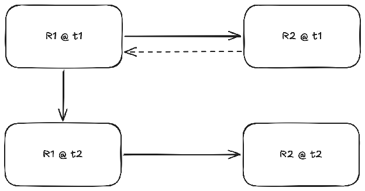
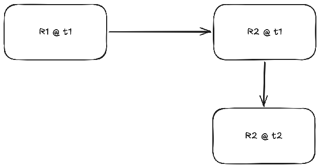
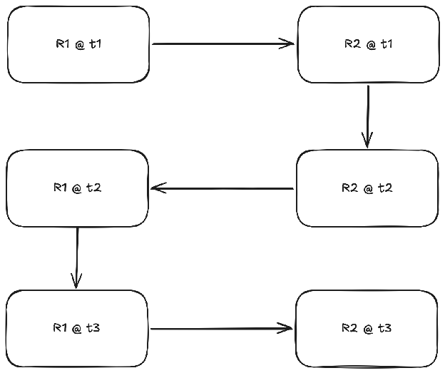
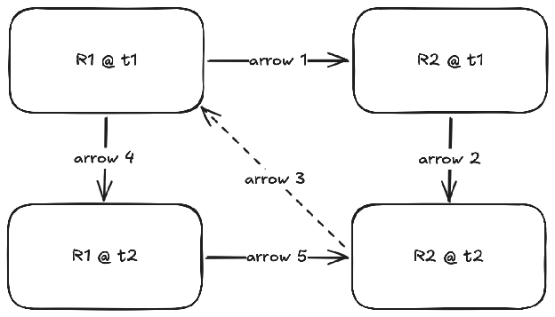
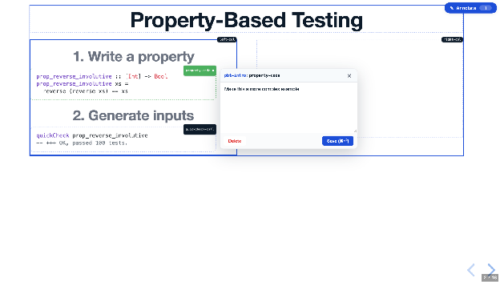

+++
title = "Representation-Free Editing"
date = "2026-06-16"
[taxonomies]
tags = ['software engineering', 'ai']
language = ["en"]
+++

Representation is an overloaded term in computer science. Colloquially, the term representation *represents* a concrete object that is the reflection of an abstract object. The representation carries over the properties of the abstract object into a new domain that is presumably more convenient for a purpose the *representer* has in mind. We use arrays to *represent* collections of items, we use adjacency lists to represent graphs, Unicode code pointers to represent written language, 64 bit integers to represent numbers. We use *language* to represent thoughts, *programming languages* to represent programs, so on, and on…

The thing about a representation is that, well, it’s distinct from the thing it’s representing. Many times, the distinction becomes practically important because the representation omits or transforms information in ways that aren’t possible to reconstruct. Take a compiler, for instance, decompilation is inherently lossy, because the machine code removes information such as types, transforms loops and branches into jumps, reorders code as needed, so we cannot have a perfect reconstruction of the source code from a given assembly.

This phenomenon is not specific to programming, you cannot reconstruct the word document from the PDF it is compiled to, you cannot reconstruct a set of polygons drawn on a canvas from the pixels it renders to. Well of course, you can have *a reconstruction* of the original document or canvas, but reconstruction is necessarily lossy because of the mismatches in representation, there are always cases that won’t perfectly map back to the original representation.

Is that so bad? Why do we really need a roundtrip property anyway?

Well, the good thing about a roundtrip is it gives us a very crucial capability, which is backpropagation. Here’s a classic one-way flow:  


We have two representations, R1 and R2; and we start with the initial version of R1 at time t1. We can obtain the corresponding R2 via computing the arrow. The broken arrow that goes from R2 to R1 is the *information*. Let’s say we’re dealing with a LaTeX document, R1 is LaTeX, R2 is PDF. We compile LaTeX to PDF, view the PDF to see if there’s anything we don’t like, and note any changes we want to make to the document, marked by the broken arrow going back to R1. We then update R1, see if the change really corresponds to the one we wanted.  This process is pretty inefficient, anyone who worked on a large latex document will tell you that. I’ll call this the *single-representation editability problem*. What you ideally want is to be able to modify the representation that gives you the information on what type of edit you want, or what kind of information do you want to present in the end result, like below:  


Well, we can do this, right? Write your document, convert to PDF, open up whatever free or cracked PDF editor is available these days, modify the PDF document itself, you get what you wanted in the first place. The unfortunate fact of the matter is you had a reason for picking R1 (latex) to write documents in the first place, a PDF editor is a terrible place to write a paper, you *really* don’t want to do that. So eventually when you realize a non-minor change, you’ll wanna go back to writing latex. What’ll happen to all the edits you did on your PDF then, they’ll go up in smoke, as if they’ve never existed. I’ll call this the *single-lineage editability problem*, you can edit many representations, but once you decide on applying a one-way arrow to switch representations, you cannot go back, you have to continue in that representation.

What would be really, really nice is if we could have two way arrows, that would be really amazing. We could do whichever edit we want on whichever representation is convenient to us, no barriers or issues whatsoever.



Unfortunately, two-way arrows in such representation pairs are very rare. First, it is very much in the interest of a representation vendor to not have the perfect roundtrip, because it lowers the switching costs. Imagine a three-way version of the same interaction. At any point the user wants to get away from R1, maybe they don’t like the vendor, or maybe the R1 software compatibility is bad with their unstable Linux distribution; they can switch to a hypothetical R3 that is also compatible with R2 by simply going R1 -> R2 -> R3. If your representation (R1) is equivalent to the target one (R2) then anyone can build a compatible representation (R3) for competing with you. These vendors must also be willing to compromise on features, open source the representation in ways that allow you to build that compatibility layer. It is also a technically hard problem, because roundtrip requires you to carry all the necessary information for reconstruction, your format is necessarily redundant, you carry not just what the document is, but also how it was constructed in a way that you can obtain the constructor.  
Many times, instead, people found an alternative way, they cheat! If you can somehow make your representation close enough to the target representation, then you can get people to just use your representation for everything. That is precisely what a “What You See Is What You Get” (WYSIWYG) editor like Microsoft Word or Google Docs do. They blur the line between the target (PDF) and the source (Word/Docs) to the point people perceive the editor to be the document. So there is no notion of a “back-arrow” because there is only one representation, **the document**, and that happens to what you see on the editor.

WYSIWYGs are great at solving the problems they solve, but they create new ones because they obscure the representation at hand. A document is, in fact, not what you see in a Word/Docs editor, at least it doesn’t have to be. Consider for instance, that Google Docs recently added a “variable” feature that allows you to refer to the same object at multiple different points via some symbolic identifier, and update all at the same time. A groundbreaking feat of technology LaTeX had for 30 years. It is arrogant to say it, but I will, I think this is why most people love Word/Docs but software engineers hate it, because they can see how things that are so easy with a simple text document can be so hard with these presumably very advanced pieces of software.

Of course if you are reading this you’ll potentially be screaming at me with how you need to solve not all the problems but the problems people really care about, but I don’t wanna go on that tangent for very long at the moment.

Let’s go back to why I actually started writing this article. **There is another way.**

I think it is possible that we can be rid of all the nonsense that comes with representations and their incompatibility and their rigidity. And I know you’ve been waiting for the magic word on how we’ll achieve that, I’m sorry to say I won’t be able to surprise you, it’s AI. However, don’t just close down the tab yet, I think the way the solution lends itself to us is very interesting and intriguing, so you might just like it.

The diagram for this one has too many arrows, so I marked arrows too, I’ll now refer to them as arrows 1 through 5.  


We again start from R1@t1, and apply the one way arrow 1 to obtain R2@t1, the hypothetical PDF document. We, like in the single-lineage case, will modify the PDF to obtain R2@t2. This is where it gets interesting. We can produce some information to signal the propagated change to R1 via arrow 3, and the AI computes arrow 4 for us, the change to R1 that, if applied, would allow us to produce R2@t2 from R1@t2. I haven’t told you the best thing yet, we already have the ultimate R2@t2 we want to obtain, so this chain of arrow 3-4-5 is a verifiable loop that we can keep continuing until we have found the correct arrow 4 that produces the exact R1@t2 we are searching for.

This is essentially a search problem, we technically don’t need any sort of intelligence here, we could simply randomly sample R1s until we have an arrow that would lead us to the R2@t2 we want, but that would take forever. Today’s models are a shortcut in that search process.

Let me now give you two real life examples on how I used this process, and how I see that it can be used going forward:

The first is a simple presentation I’ve prepared for presenting my paper, it is actually available at [https://programmable-pbt.pages.dev/](https://programmable-pbt.pages.dev/)

Here’s the setup. I love preparing presentations and spending time on them, but I would also be grateful if I could get a model to spew out a presentation version of my paper that I could gradually turn into something I like instead of pulling graphs and sentences from the paper one by one. I’m sure there are people trying to use AI to generate PPTX files, but I didn’t really wanna deal with that and wanted to start with something I know I can inspect and rely on, a standalone HTML file. HTML files are even better than PPTX because you can write custom native JavaScript animations very easily, but I would simply never write a HTML file just for a presentation, so it’s actually two birds with one stone.

Well of course, the model being the model, produces something that has some of the information in the paper; in an order I do not want, in a shape I do not like, and generally in a vibe I do not have. I would like to change this presentation. Note that this resembles the first setup right now, the prompt box is the source representation I use, the HTML is the target representation I view and comment on, model is the forward arrow.

I did two crucial things, the first is I vibecoded an inline editor using content-editable that allows me to change the content of any textbox in the presentation, and I’ve created an annotation system that I can mark an HTML component, write some comments/annotations about it.  
  
This comment is then turned into a note in a local file:

```json
{
  "pbt-intro:property-code": {
    "createdAt": "2026-05-08T16:03:41",
    "elementName": "property-code",
    "key": "pbt-intro:property-code",
    "slideSlug": "pbt-intro",
    "text": "Make this a more complex example",
    "updatedAt": "2026-05-08T16:03:41"
  }
}
```

I set up a monitor for any changes on this file, so that when the model sees any notes it automatically goes into the HTML file and changes it, the web server hot reloads, I see the change which I approve and continue or decline and revert.

A great thing about this approach is that I can strengthen my editing capabilities in R2 (HTML) as much as possible, I can start moving boxes around, creating new boxes etc. that people that build editors have been adding for the last 20 years to their editing software. However, I am also free to use the prompt box as freely as I want to for doing anything that the native editing capabilities do not allow me to do.

The second example is I think even better to demonstrate what’s new here, because it doesn’t use the prompt box as the source target, it uses Beamer, a presentation library for LaTeX as the source, and PDF as the target. And it features my girlfriend, who is definitely not a nerd software person so she would NEVER do anything like this if it wasn’t convenient.

Long story short, she was preparing a presentation with Beamer against all my advice, and she wanted to add some pictures to it. But she had too many pictures she wanted to add, and she wanted to be able to see them as she was adding them, like how you would see it in a normal editor. I asked her how she would do it, she told me she’s going to write up all the document, and then switch to a PDF editor to add the pictures and be done with it. Well I already explained the problem with her approach, once you switch representations you cannot go back, single-lineage editability.

I wanted to see if we could use the representation-free editing flow in this scenario too. So I asked her to put all the pictures in the document first, and then ask Claude to extract the positions of the pictures from the document, make the corresponding changes to the .tex file, compile it, and then we looked at it side-by-side to verify, and we were done!

What else is this possibly useful in? Well life, or at least software engineering, is full of one-way conversions that lock us into a representation. For instance, think about your query optimizer, which takes your SQL, produces a query plan, optimizes it, and gives you the optimized query plan back. Wouldn’t it be nice if you could know the SQL that would generate the optimized plan in the first place? Could we take a piece of assembly, optimize or change it in some way, then propagate the changes back to the source code?

It is not that we fundamentally cannot solve these problems today. We can design pairs of languages that map perfectly to each other, or design toolchains that carry enough information for perfect reconstruction that would allow such backpropagation, but we must design our systems around these constraints, or build additional tools that we don’t have in many cases. The optimized search gives us representation-free editability and backpropagation, almost for free, for convenient use.  
