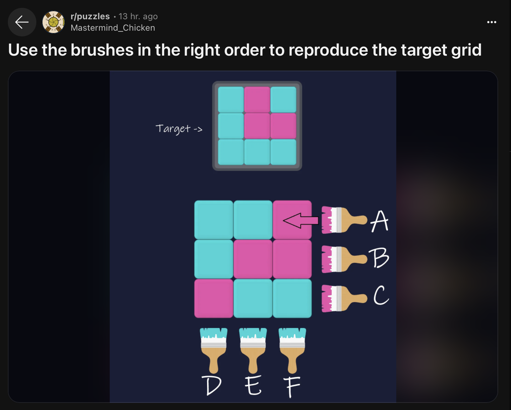

+++
title = "Solving Algorithmic Problems: Painting a Grid"
date = "2024-06-01"
[taxonomies]
tags = ['puzzle', 'algorithms']
language = ["en"]
+++

<p>
 Earlier today, I saw a
 <a href="https://www.reddit.com/r/puzzles/comments/1c4pj67/use_the_brushes_in_the_right_order_to_reproduce/">
  cute
            little puzzle on Reddit
 </a>
 . The puzzle is pretty simple, we have a 3x3
        grid where each square is either pink or turquoise. We are also given a
        target grid with a different configuration of colors. Finally, we can
        use 3 horizontal brushes(A, B, and C) that is pink, or 3 vertical
        brushes(D, E, and F) that is turquoise. The goal is to find the minimum
        number of brush strokes required to paint the target grid.
</p>
<figure>

 
</figure>
<p>
 It took me a couple of minutes to come up with the solution, I’m
        leaving the answer below in a spoiler box. If you want to try it
        yourself, please do so before reading the answer.
</p>
<details>
 <summary>
  <b>
   Click to see the answer
  </b>
 </summary>
 <p>
  The solution is
  <code>
   A F B D
  </code>
 </p>
</details>
<p>
 The next thought I had was,
 <strong>
  how hard would it be to write a
            program that solves this problem for any given grid?
 </strong>
 . I thought
        it would be a fun little exercise to write a program that solves this
        problem. Although I don’t think my solution is perfect(my intuition is
        that there are cases where it takes the wrong step which is possible to
        detect in the future and revert, but I didn’t implement it), I’m happy
        with the simplicity of the result.
</p>
<p>
 The first question that requires answering when solving such a
        question is, what does the solution space look like? If the solution
        space is very small, we can just enumerate all of them(hint: it’s not
        that large). For a 3x3 grid, we only have 6 brushes, and using a brush
        twice does not provide any additional benefit. This is an important
        insight into pushing the solution space down, so let’s think about why
        that is for a second.
</p>
<p>
 The reason why, is that there is only one way to paint a square. If
        we want to paint a square pink, we have to use the horizontal brush on
        that level, if we want to paint a square turquoise, we have to use the
        vertical brush on that level. Let’s say that we have a sequence of brush
        strokes
 <code>
  x_1, x_2, x_3...
 </code>
 . The question we need to ask is,
        why do we even care about the order of strokes to begin with? The reason
        is that
 <code>
  column
 </code>
 and
 <code>
  row
 </code>
 strokes don’t
 <strong>
  commute
 </strong>
 . Applying
 <code>
  r_i
 </code>
 where
 <code>
  r_i
 </code>
 is the row stroke for the i’th row, and
 <code>
  c_i
 </code>
 where
 <code>
  c_i
 </code>
 is the column stroke for the
        i’th column, is not the same as applying
 <code>
  c_i
 </code>
 and then
 <code>
  r_i
 </code>
 .
 <code>
  r_i c_j
 </code>
 means that
 <code>
  cell[i, j]
 </code>
 is painted
 <code>
  turqoise
 </code>
 , and
 <code>
  c_j r_i
 </code>
 means that
 <code>
  cell[i, j]
 </code>
 is painted
 <code>
  pink
 </code>
 . This gives us two piece of information:
</p>
<ol type="1">
 <li>
  Order of strokes matter.
 </li>
 <li>
  By changing the order of two strokes, we can change the color of a
            cell in the way we want.
 </li>
</ol>
<p>
 As we can change the color of a cell by changing the order of
        strokes, running
 <code>
  c_i ... r_j ... c_i
 </code>
 is the same as running
 <code>
  r_j ... c_i
 </code>
 . That is it is sufficient to use each stroke
        once. Although working, this solution did not really satisfy my
        curiosity, it was just too inelegant.
</p>
<p>
 The next step we can take is to invert our thinking process for the
        previous solution. Previously, we decided that we can always change the
        order of two strokes when we want to change the color of something.
        Thinking backwards, this also means that we can just place the strokes
        in the order we want to paint the cells. If we want to paint cell
 <code>
  i, j
 </code>
 pink, now we know that our solution must be in the
        form
 <code>
  ... c_i ... r_j ...
 </code>
 . For this solution, we will first
        calculate the difference of the current grid and the target grid, then
        we will find a set of moves required to paint the grid in the way we
        want. We will order the strokes with respect to the painting order, and
        apply the first stroke in the list. After the application, we recompute
        the difference, and continue this process until the paintings are the
        same.
</p>
<p>
 This solution scales much better, as it’s local. We use a greedy
        approach to solve the problem, so we don’t have to generate the whole
        permutation space of strokes. The solution is also very simple to
        implement, the solver logic relies on the two functions provided in
        Typescript below. The order managed the order of strokes to solve
        commutation issues, and the solve function applies the strokes in the
        order provided by the order function.
</p>
<input id="paintbrush.ts" type="hidden" value='const order = (d1: Directive, d2: Directive, c: Canvas): number =&gt; {
    if (d1.orient === d2.orient) {
        return 0;
    }

    let dr = d1.orient === "row" ? d1 : d2;
    let dc = d1.orient === "column" ? d1 : d2;

    let t = c[dr.index][dc.index];

    if (d1.orient === "row" &amp;&amp; t === "pink") {
        return -1;
    } else if (d1.orient === "column" &amp;&amp; t === "blue") {
        return -1;
    } else {
        return 1;
    }
}

const solve = (c1: Canvas, c2: Canvas): Directive[] =&gt; {
    let path : Directive[] = [];

    while (different(c1, c2)) {
        let d = diff(c1, c2);
        let dirs = getDirectives(d);
        let sortedDirs = dirs.sort((d1, d2) =&gt; order(d1, d2, c2));
        let dir = sortedDirs.pop() as Directive;
        c1 = applyDirective(c1, dir);
        path.push(dir);
    }

    return path;
}'/>


```typescript,linenos
const order = (d1: Directive, d2: Directive, c: Canvas): number =&gt; {
    if (d1.orient === d2.orient) {
        return 0;
    }

    let dr = d1.orient === "row" ? d1 : d2;
    let dc = d1.orient === "column" ? d1 : d2;

    let t = c[dr.index][dc.index];

    if (d1.orient === "row" &amp;&amp; t === "pink") {
        return -1;
    } else if (d1.orient === "column" &amp;&amp; t === "blue") {
        return -1;
    } else {
        return 1;
    }
}

const solve = (c1: Canvas, c2: Canvas): Directive[] =&gt; {
    let path : Directive[] = [];

    while (different(c1, c2)) {
        let d = diff(c1, c2);
        let dirs = getDirectives(d);
        let sortedDirs = dirs.sort((d1, d2) =&gt; order(d1, d2, c2));
        let dir = sortedDirs.pop() as Directive;
        c1 = applyDirective(c1, dir);
        path.push(dir);
    }

    return path;
}
```

</div>
<p>
 If I’m not mistaken, this method should be able to solve NxNxN…xN
        grids in K dimensional spaces. The solution is not perfect, as it can
        actually lead to double strokes in some cases, but this would be
        immediately solved by keeping only the last stroke in the list. I
        published the code on
 <a href="https://gist.github.com/alpaylan/ce3321f41bfa367997847b2ef79ea10f">
  Github
 </a>
 ,
        and below is a playground where you can actually generate grids and see
        the results.
</p>
<p>
 An important point that I should also not that the problem does not
        really have a general solution, since there are grid pairs where it’s
        impossible to paint the target grid with the given brushes. I’m not sure
        how to prove this, if we had a proof that the state space is
        finite(which we believe, as we already said that using each brush only
        once is enough), then we could just provide a counterexample showing
        that it’s impossible to paint the target grid from that starting
        configuration, but that reasoning does not hold if we don’t actually
        prove that the state space is finite. We could also show cyclicity,
        which I think should be easy to do, but I didn’t try it.
</p>
<table style="all:unset; display: body; float: left; margin-right: 20px;">
 <tbody>
  <tr>
   <td id="c1-0-0">
   </td>
   <td id="c1-0-1">
   </td>
   <td id="c1-0-2">
   </td>
  </tr>
  <tr>
   <td id="c1-1-0">
   </td>
   <td id="c1-1-1">
   </td>
   <td id="c1-1-2">
   </td>
  </tr>
  <tr>
   <td id="c1-2-0">
   </td>
   <td id="c1-2-1">
   </td>
   <td id="c1-2-2">
   </td>
  </tr>
 </tbody>
</table>
<table style="all:unset; display: body; float: left; margin-right: 20px;">
 <tbody>
  <tr>
   <td id="c2-0-0">
   </td>
   <td id="c2-0-1">
   </td>
   <td id="c2-0-2">
   </td>
  </tr>
  <tr>
   <td id="c2-1-0">
   </td>
   <td id="c2-1-1">
   </td>
   <td id="c2-1-2">
   </td>
  </tr>
  <tr>
   <td id="c2-2-0">
   </td>
   <td id="c2-2-1">
   </td>
   <td id="c2-2-2">
   </td>
  </tr>
 </tbody>
</table>
<button id="show-solution">
 Show Solution
</button>
<button id="reset">
 Reset
</button>
<input id="speed-slider" max="100" min="0" type="range" value="30"/>
Adjust Speed
<input id="speed" type="hidden" value="1000"/>
<h4>
 Moves
</h4>
<ul id="moves">
</ul>
<script>
 var generateCanvas = function () {
            // A Canvas is a 3x3 grid of colors
            var genColor = function () {
                return Math.random() > 0.5 ? "blue" : "pink";
            };
            var canvas = [];
            for (var i = 0; i < 3; i++) {
                canvas.push([]);
                for (var j = 0; j < 3; j++) {
                    canvas[i].push(genColor());
                }
            }
            return canvas;
        };
        var copyCanvas = function (canvas) {
            var newCanvas = [];
            for (var i = 0; i < 3; i++) {
                newCanvas.push([]);
                for (var j = 0; j < 3; j++) {
                    newCanvas[i].push(canvas[i][j]);
                }
            }
            return newCanvas;
        };
        var paintRow = function (canvas, row) {
            var newCanvas = copyCanvas(canvas);
            for (var i = 0; i < 3; i++) {
                newCanvas[row][i] = "pink";
            }
            return newCanvas;
        };
        var paintColumn = function (canvas, column) {
            var newCanvas = copyCanvas(canvas);
            for (var i = 0; i < 3; i++) {
                newCanvas[i][column] = "blue";
            }
            return newCanvas;
        };
        var diff = function (canvas1, canvas2) {
            var diffCanvas = [];
            for (var i = 0; i < 3; i++) {
                diffCanvas.push([]);
                for (var j = 0; j < 3; j++) {
                    if (canvas1[i][j] === canvas2[i][j]) {
                        diffCanvas[i].push("same");
                    }
                    else {
                        diffCanvas[i].push(canvas2[i][j]);
                    }
                }
            }
            return diffCanvas;
        };
        var getPinkedRows = function (canvas) {
            var hasPink = function (row) {
                return row.some(function (color) { return color === "pink"; });
            };
            var pinkedRows = [];
            for (var i = 0; i < 3; i++) {
                if (hasPink(canvas[i])) {
                    pinkedRows.push(i);
                }
            }
            return pinkedRows;
        };
        var getBluedColumns = function (canvas) {
            var hasBlue = function (column) {
                return column.some(function (color) { return color === "blue"; });
            };
            var bluedColumns = [];
            for (var i = 0; i < 3; i++) {
                if (hasBlue([canvas[0][i], canvas[1][i], canvas[2][i]])) {
                    bluedColumns.push(i);
                }
            }
            return bluedColumns;
        };
        var different = function (canvas1, canvas2) {
            return diff(canvas1, canvas2).some(function (row) { return row.some(function (color) { return color !== "same"; }); });
        };
        var getDirectives = function (diffCanvas) {
            var pr = getPinkedRows(diffCanvas);
            var bc = getBluedColumns(diffCanvas);
            var directives = [];
            pr.forEach(function (row) {
                directives.push({ orient: "row", index: row });
            });
            bc.forEach(function (column) {
                directives.push({ orient: "column", index: column });
            });
            return directives;
        };
        var printCanvas = function (canvas) {
            var printCell = function (color) {
                return color === "blue" ? "O" : "X";
            };
            canvas.forEach(function (row) {
                console.log(row.map(printCell).join(""));
            });
        };
        var applyDirective = function (canvas, directive) {
            return directive.orient === "row" ? paintRow(canvas, directive.index) : paintColumn(canvas, directive.index);
        };
        var order = function (d1, d2, c) {
            if (d1.orient === d2.orient) {
                return 0;
            }
            var dr = d1.orient === "row" ? d1 : d2;
            var dc = d1.orient === "column" ? d1 : d2;
            var t = c[dr.index][dc.index];
            if (d1.orient === "row" && t === "pink") {
                return -1;
            }
            else if (d1.orient === "column" && t === "blue") {
                return -1;
            }
            else {
                return 1;
            }
        };
        var solve = function (c1, c2) {
            var path = [];
            while (different(c1, c2)) {
                var d = diff(c1, c2);
                var dirs = getDirectives(d);
                var sortedDirs = dirs.sort(function (d1, d2) { return order(d1, d2, c2); });
                var dir = sortedDirs.pop();
                console.log("Applying directive: ", dir);
                c1 = applyDirective(c1, dir);
                path.push(dir);
            }
            return path;
        };
        // let c1 = generateCanvas();
        // let c2 = copyCanvas(c1);
        var genDirective = function () {
            return { orient: Math.random() > 0.5 ? "row" : "column", index: Math.floor(Math.random() * 3) };
        };
        var genTarget = function (c1) {
            var c2 = copyCanvas(c1);
            for (var i = 0; i < 100; i++) {
                var d = genDirective();
                c2 = applyDirective(c2, d);
            }
            return c2;
        };
</script>
<script>
 let c1 = generateCanvas();
        let c2 = genTarget(c1);

        let cs = {
            "c1": c1,
            "c2": c2
        };

        const toRgb = (color) => {
            return color === "blue" ? "#41C9E2" : "#D862BC";
        }
        const paintCanvas = (cid) => {
            console.log(cs[cid]);
            for (let i = 0; i < 3; i++) {
                for (let j = 0; j < 3; j++) {
                    document.getElementById(cid + "-" + i + "-" + j).style.width = "20px";
                    document.getElementById(cid + "-" + i + "-" + j).style.height = "20px";
                    document.getElementById(cid + "-" + i + "-" + j).style.backgroundColor = toRgb(cs[cid][i][j]);
                }
            }
        }

        paintCanvas("c1");
        paintCanvas("c2");

        let path = solve(c1, c2);
        // Add li to the moves list
        document.getElementById("moves").innerHTML = path.map((p, i) => `<li id="move-${i}"">${p.orient + p.index}</li>`).join(" ");

        console.log(path);

        document.getElementById("show-solution").addEventListener("click", function () {
            let i = 0;
            let interval = setInterval(function () {
                if (i < path.length) {
                    cs["c1"] = applyDirective(cs["c1"], path[i]);
                    console.log(cs["c1"]);
                    document.getElementById("move-" + i).style.textDecoration = "line-through";
                    paintCanvas("c1");
                    i++;
                } else {
                    clearInterval(interval);
                }
            }, parseInt(document.getElementById("speed").value));
        });

        document.getElementById("reset").addEventListener("click", function () {
            c1 = generateCanvas();
            c2 = genTarget(c1);
            cs = {
                "c1": c1,
                "c2": c2
            };
            paintCanvas("c1");
            paintCanvas("c2");
            path = solve(c1, c2);
            document.getElementById("moves").innerHTML = path.map((p, i) => `<li id="move-${i}"">${p.orient + p.index}</li>`).join(" ");
        });

        document.getElementById("speed-slider").addEventListener("input", function () {
            document.getElementById("speed").value = 30000 / (parseInt(document.getElementById("speed-slider").value) + 10);
            console.log(document.getElementById("speed").value);
        });
</script>
