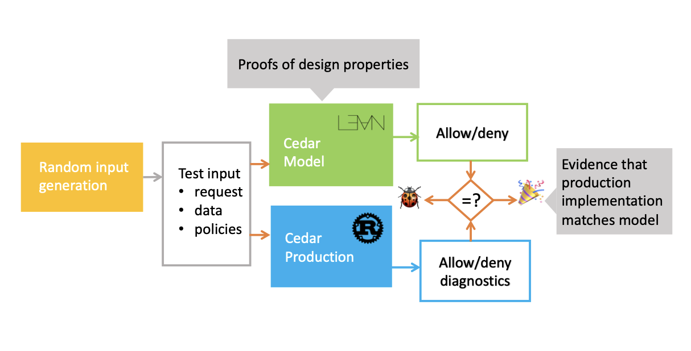

+++
title = "Test, don't (just) verify"
date = "2025-12-22"
[taxonomies]
tags = ['software engineering', 'testing', 'formal methods']
language = ["en"]
+++

AI *is* making formal verification go mainstream.

AI-assisted mechnical proving companies are raising funds on billion dollar [valuations](https://www.reuters.com/business/robinhood-ceos-math-focused-ai-startup-harmonic-valued-145-billion-latest-2025-11-25/), new people are trying proof assistants,
overwhelmingly Lean, at unprecedented rates. Models achieve fascinating results in competitions previously considered to contain
some of the hardest problems in the world, such as IMO, ICPC, Putnam; as well as open problems in mathematics such as Erdös Problems.
It's not just the hobbyists that are excited about AI-assisted proofs, from [Terry Tao](https://terrytao.wordpress.com/wp-content/uploads/2024/03/machine-jan-3.pdf), to [Martin Kleppman](https://martin.kleppmann.com/2025/12/08/ai-formal-verification.html), to [Ilya Sergey](https://x.com/ilyasergey/status/1989053674552004749), prominent researchers around the world are excited and hopeful about the effects.

## Formal Verification: The Goods

Let me quickly give you a run down of the argument:

There are multiple complex challenges in formal verification. The first one, and the one that is very hard to solve technically,
is that most software in the world does not have a formal specification. A formal specification is a simpler mathematical description
of the system we build. Algorithms have formal specifications. Data structures, protocols, data formats, safety-critical systems typically
have formal specifications. The majority of the programs in the world doesn't have a formal specification, hell, most of them don't even have
informal specifications. At the limit, which is where we actually are, the specification of a program is itself, the implementation is the
specification. The lack of a formal specification makes it very hard to formally verify some piece of software, because what would you even
verify?

The second issue is, proof engineering, the practice of writing proofs for theorems about your systems, is very hard. The proofs have many domain
specific elements to them, a proof of a mathematical theorem will be very different from a proof about a programming language, and a proof about the programming
language will highly depend on the underlying constructs of its theoretical framework. The widest taught proof engineering book
is [Software Foundations](https://softwarefoundations.cis.upenn.edu), and every chapter has a different style of proofs. Someone that went through
Volume 2: Programming Language Foundations will not find the problems in Volume 6: Separation Logic Foundations intuitive or obvious. There are other problems
such as the tooling for proof automation, brittleness of proofs, reusability of proofs etc. but I don't find them particularly fundamental to proof engineering
itself but rather problems of the current generation, so we can leave those aside for now.

The rise of LLMs in programming vastly affects both of these points. It affects point number 1 because AI-assisted programming is a very natural fit
fot specification-driven development. AI-assisted programming pushes the limits of programming from what you can implement to what you can specify and
what you can [verify](https://alperenkeles.com/posts/verifiability-is-the-limit/). This is a great incentive for writing executable specifications,
because then you can put the LLM inside a loop until it achieves the said objective, irrespective of the means of the achievement.
[I predict that](https://alperenkeles.com/posts/verifiable-abstractions/) this will give rise to program optimizers and translators that will
be transformative of our work in those domains. However, tests are, as infamously they are, incomplete. Tests are great at finding bugs (actually
they are not so great most of the time, but that's another discussion), but they **cannot** prove the absence of bugs. SQLite famously has
millions of tests, but researchers still find bugs in SQLite, similar situations arise in almost all software.

The only way to prove the absence of bugs is formal verification, and industry has seen great examples of this. Highly cited formal verification
projects include CompCert C Compiler, [the random testing of which against GCC and Clang](https://users.cs.utah.edu/~regehr/papers/pldi11-preprint.pdf)
has led to finding 79 bugs in GCC and 202 bugs in Clang, and only 2 bugs in CompCert in its *unverified* parser, finding no bugs in its verified compilation
pass, a striking win for formal verification. (Thanks to [A. Jesse Jiryu Davis](https://emptysqua.re/blog/) informing me, I learned that researchers have
[studied](https://www.cs.purdue.edu/homes/pfonseca/papers/eurosys2017-dsbugs.pdf) the source of failures in formally verified distributed systems, and
found that wrong assumptions about the unverified parts of the system are the likely culprit.)

This makes formal verification a prime target for AI-assisted programming. Given that we have a formal specification, we can just let the machine wander around
for hours, days, even weeks. If it comes back with a solution, we shall trust not to the probabilistic predictions of the so-called artificial intelligence,
but the symbolic proof checker that verifies the solution. This idea has always been at the core of formal verification, the ability to have unsound proof
generation coupled with sound proof checking has given rise to complex tactics, algorithms that produce proofs by searching them, to enable proof engineers
in great capacity.

This is not the end of the good news. AI is also very good at writing proofs, at least much better than the average software engineer. Given that we have
a perfect oracle, we can also turn the problem into an RLVR (Reinforcement Learning with Verifiable Rewards), which means we should expect the models to get
even better at it as time goes on as they did in chess, go, and many other similar problems. This is the promise behind the billion dollar valuations,
the companies started with impressive autoformalization techniques and automated provers for tackling competition problems and open conjectures, but
the real industrial value is at the core of automating software engineering by letting the engineer write a verbal description, autoformalized into a Lean
theorem, proven by the automated prover, and voila, we have our program that we can fully trust.

*or do we?*

## Formal Verification: The Bads

I see the appeal, I like the idea, I trust the researchers building these systems, but I don't love the overarching promises. This blog post
is my attempt at building a reasonable middle ground by laying out the goods (as I already did), and the bads (as I now will), and make my closing
remarks by reiterating the position of testing in this space, and in the future.

### Autoformalization is a shaky ground

I started this post by stating most programs in the world do not have formal specifications, followed by how AI is incentivizing us to write specifications,
and autoformalization takes the specifications, and makes them **formal**. In formal verification, there's this concept of a *trusted computing base (TCB)*. TCB
is your Achilles' Heel, it's the bottom of the ladder, where layers over layers of verification is built on, trusting a small core without verifying it, because
there must be a bottom of the ladder, we cannot build a circular verification argument, and the system cannot verify itself. (please fact check me on this
if I'm wrong, which is possible)

Autoformalization is part of the TCB in this AI-assisted verified programming paradigm, because one cannot mechanically verify that the verbally stated
specification indeed corresponds to the formalized one. There are several modes of usage, one issue is soundness, there might be mechanically verified scenarios
that would be rejected by the verbal specification. Another issue is completeness, the formalized model might reject valid scenarios in our descriptions.
Autoformalization part of the process requires and deserves our special attention as it's one of the crucial points of failure in this verification process.

### Proof assistants are slow

In a proof assistant, the primary goal is reasoning about programs and ease of verification. For instance, proof assistants, traditionally, don't use our classic
two's complement integers packed into words in our memory, they use Peano numbers, an encoding of natural numbers as inductive data structures:

```lean
Inductive Nat : Type :=
| zero : Nat
| succ : Nat -> Nat.
```

This encoding doesn't possess the concept of an integer overflow. Its inductive structure allows us to build theorems that hold for all natural numbers, not
just the ones that can fit in a word. It is also painfully slow, the computational complexity of `a + b`, an operation so fast in CPU that it's literally
an instant, is `O(a + b)`, addition is linear in time to the added values instead of a constant operation. However, we would like to run verified code on
real life workloads, so we cannot wait for a million cycles to add 1M + 1M = 2M. There are 2 solutions to this problem, the first one is that you build a
more efficient encoding in the proof assistant, prove equivalence of the efficient but hard to reason encoding to the inefficient but simpler to reason one,
and use the efficient one in your computations. The other is once again, axiomatization, or broadening the TCB. Proof assistants offer a mechanism called
**extraction** that allows for extracting a piece of code in the language of the proof assistant (e.g Rocq) to a language with a larger ecosystem optimized
for running production workloads (e.g OCaml). Much of the extraction is a one-to-one correspondence between the languages via syntactic transformations,
but we can hijack the extraction to axiomatize our own types. We can turn Nat into unsigned integers, where `Nat.add` becomes `u64 + u64`. For instance,
in Rocq, Nats are extracted to BigInts, which should have the same semantics, but the "should" in this sentence carries the heavyweight. Without an accompanying
proof of correctness, we just put BigInt into the TCB.

Without broadening the TCB, the speed of a proof assistant will be limited by the large amount of pointer chasing that arises naturally with the use of
inductive types and their tree-inducing characteristics. There are many domains in which speed isn't that big of a deal, but I think there's also a
concern between speed and the requirement for correctness, as faster code tends to involve more complex language constructs such as concurrency,
bit manipulation, layout awareness, which leads to more bugs than their simpler counterparts. If we cannot reason about programs that are more likely
to have bugs, how much of the overarching problem are we tackling?

### Verification requires models, and models are very hard to come by

In order to verify some property of a system, one needs a model of the system. These models don't grow on trees, they are crafted by domain
experts over a number of years. People have been building models for programs with pointers (separation logic), as well as programs with
concurrency, programs with randomness, programs with algebraic effects, and perhaps many more that I haven't even heard of. In proving a property
of the system, we need a foundation for our reasoning process, which these theories give us for their respective domains. However, there are many
domains we don't have good models for, one example is runtime performance. This has been a contentious issue in the computer science curriculum, the
asymptotic complexity does not translate to program behavior in real hardware. Modern CPUs have cache lines, speculative execution, branch prediction
that makes the plain old abstract machine used in asymptotical analysis obsolete for many scenarios. We do not even have a single hardware to conform
our model to, we have tens of different configurations of hardware, each of which will give different results in our measurements. If we tried to prove
that some piece of code has a better result for a specific memory/processor pair than another one, we would have a massive job on our hands, I personally
don't even know where I would start with.

Contrast this to testing, where you can just spin up the same algorithm on both machines, run our benchmarks, which will be our final ground truth. Testing
is almost universally considered inferior to formal verification, it is what you do when you don't have the resources to justify verification, because if you
had the opportunity to spend the time, proving absence of bugs, or universal facts about your system, would be much more valuable than codifiying the results
of singular measurements. I am here to tell you that there are tests we can write that could not be formally verified, because while building the underlying
models for verification might be hard, just using the real hardware for our measurements can be much easier.

### Verification doesn't tell you that you are going down the wrong path

In games, there are clear winners and losers. In verification, you can prove that your theorem is correct, you can prove that your theorem is incorrect, but
absence of a proof for a theorem does not imply that the theorem is incorrect, it is possible that you just haven't found the proof. This means the feedback
you get when writing a proof is limited as you cannot rely on your inability to progress as a signal about your theorem, it is plausible that you are the problem.
This is why QuickChick, a testing tool descending from the famous QuickCheck of Haskell that introduced Property-Based Testing to the world, exists in Rocq
ecosystem as one of the three most popular packages. If verification was strictly superior to testing, QuickChick would have no reason to exist, but it serves
a very crucial role that the verification process needs, **falsification**. I had said that the absence of a proof does not imply that a theorem is wrong, but the witness of a violation of the theorem definitely does. Random testing is the prime suspect for finding such counterexamples, pulling the verifier out of the
rabbit hole of going through many useless paths in the proof search before giving up, because the theorem is ultimately wrong, there is no proof to be found.

## Random Testing and Formal Verification

I have given examples of tests that formal verification is incapable of modeling, and examples of tests that complement formal verification process by creating
a short that falsifies false theorems instead of trying to prove them in vain. The synergy between testing and formal verification doesn't end here, I am a firm
supporter of Verification-Guided Development (VGD), which in addition to leveraging this synergy, solves the problem of proof assistants being too slow. In verification
guided development, we implement two versions of the same system, one is the simpler to reason, verified version, the other is the complex, production one. We then
test the property that the production system conforms to the reference implementation that is verified by running them with the same inputs and asserting that
the result is the same every single time. VGD *lifts* the proof to the production implementation from the slower one implemented in the proof assistant by leveraging
differential random testing, which allows for building a best-of-both-worlds system that is both correct and fast. Below is an image taken from the paper that (as far as I know) introduced
the notion of VGD, explaining their workflow.



VGD doesn't solve all the issues I mention in the rest of the post, but it removes the slowness out of the mix. As we have a production implementation ready to be tested thoroughly,
we can make all kinds of measurements that fall out of the purview of verification, but into the realm of testing. It levels the playing field between the verified realm of computing
and the unverified one, reducing the downsides of the verification leveraging testing.

## Closing Remarks

I would like to state it once more for everyone:

**I see the appeal, I like the idea, I trust the researchers building these systems, but I don't love the overarching promises. This blog post
is my attempt at building a reasonable middle ground by laying out the goods, and the bads, and make my closing
remarks by reiterating the position of testing in this space, and in the future.**

I believe random testing plays as important of a role as formal verification in the future of software engineering. We will not have magically formally verified systems
in many domains, but as autoformalization tools get better, we will have many, many more formal specifications. Random testing benefits from these formal specifications
in different ways than formal verification, but both have their places. Proof systems will be incomplete without the accompanying testing tools, and the testing tools
will be incomplete without proofs of correctness, it is only possible via some combination of verification and testing that we can achieve our ideals of the future of
software engineering, live in a world where bugs are considered anomalies instead of the norm, where correctness is a virtue, and the bugs in our systems are as old and
as forgotten as the diseases we learned to cure and put away.
