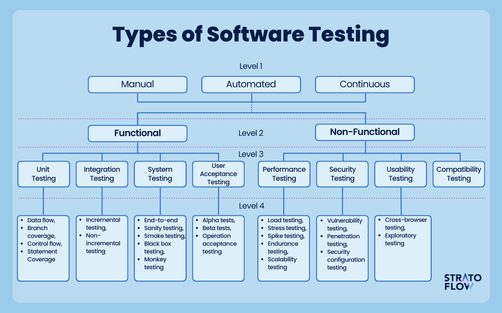

+++
title = "A Better Vocabulary for Testing"
date = "2025-08-16"
[taxonomies]
tags = ['testing']
language = ["en"]
+++

Contemporary vocabulary for talking about software testing has bothered me for a long time. The concept of a unit in unit test is not really defined,
integration tests are integrating arbitrarily scoped modules, the concept of an E2E test makes sense, but it very much underspecifies the actually tested behavior as well as methods for testing it, are you using automated agents, human supervision, predefined set of actions, random exploration... it's all sweeped under the rug. On the other side you have your stress tests, load tests, peneration tests etc. but there is no proper classification in the wild, it all seems to be based on "vibes". A short web search reveals a "level" based classification as seen below, as well as an "ad" from Atlassian that gives you [7 "types" of software tests](https://www.atlassian.com/continuous-delivery/software-testing/types-of-software-testing).

Can we go beyond this, definitely. Should we, I think yes. We should have a vocabulary that is actionable, you should be able to upgrade or downgrade your tests based on the availability of resources, there should be a recipe for the available set of options given your situation. Of course, this article will be very much biased towards a certain category, random testing which I happen to be working on for a while now.

My view is as follows, we can roughly create 5 different categories, some of which are orthogonal to each other, some of which "branch" within.

## Scopes of Testing

The first category is a **the scope of the test unit**, this is similar to what the classic unit/integration/e2e testing classification tries to vaguely define, but I think it fails at it. There are two axes to the scope, one of them is based on the constructs of the programming language we use, we might test a function, a class/struct/type, a module, or a system. The secondary axis is if the scope is a stateful, or a stateless one. You might have stateful functions, and you might have stateless systems, although we expect most functions to be stateless and most systems to be stateful. It should be noted that these scopes also vary a lot, one could argue that the entry function of a large system is the same as the system itself, but here is why the scopes are useful;

When talking about testing anything, we typically talk about inputs and outputs, but the space of inputs are actually very different. Functions, especially stateless ones, consume arbitrary structures in your programming language. Systems receive interactions or directives, which is typically some serialized piece of data that is parsed and validated. This actually allows system testing to be much more restrictive in the list of inputs because it includes a natural discriminator that can shrink the input space, while function signatures in programming are very often too relaxed, the input type of the function includes many potential inputs that the function will never consume.

When state comes into play, your testing can be made isomorphic to the previous one by turning a test of function `f` with state `s` consuming input `x` and producing output `y` and transforming the state to `s'` into another stateless function `g` that either produces initial the state `s` or the state pair `(s, s')` becomes a part of the input-output.

This type of state(ful/less)ness transformation depends on the complexity of your system, because testing an input requires you to produce it. Simple states can be turned into inputs that you can construct, but creating a complex state that represents a realistic workload of your system is non-trivial, and for many systems outright impossible. In such scenarios, instead of transforming your test to be stateless, you treat your system as a simulation. You pass in messages that contain directives or interactions based on the public API of your system and get answers or confirmations in multi-message scenarios, you can check intermediate states of the system as well as the initial and final ones, ensuring your invariants, preconditions and postconditions hold.

Similarly for making the testing of your functions more tractable, you can employ [Design by Contract (DbC)](https://en.wikipedia.org/wiki/Design_by_contract) which is natively supported in C++26, D, Kotlin, and Racket, with library support in Python and Rust, and many others I probably haven't heard. In DbC, we can write the assumptions we make on the inputs to the functions, which might come up as unchecked pointer dereferences or code comments promising that such inputs are not possible, as annotations to our functions, which can be checked on runtime, and sometimes even compile time through static analysis. DbC allows us to constraint the input space to the functions, which as I said are at many times much larger than the reality. Imagine creating a dictionary of items you read in your system, along with a list of keys that were created alongside the initial hashmap. To the view of your programming language, every lookup in your hashmap is fallible, when in reality we know all of them should succeed. This creates a tension between you and the programming language, where you feel like you are fighting with it. Using DbC, more expressive type systems, and better domain modeling solves much of these issues.

## Purposes and Hypotheses of Testing

Testing, at some level, evaluates or measures "something". It creates a hypothesis that can be falsified by running the test, and the purpose is to falsify this hypothesis. There are different domains that we can express some hypotheses on; the simplest one is functional correctness, which evaluates if the function produces the right output given some set of inputs. There are other domains such as time of execution, which we can test the performance of our system under test, or security, which we can check if the system is resistant to potential attack vectors. Most large scale systems are distributed systems that are bound by the laws of physics that can cause delays, drops, faults in the network, and even single machine systems experience file system fauls, disk corruptions etc. which we can test our system's resilience against. The concept of chaos testing mostly refers to testing the robustness of a system in the case of unexpected faults.

Based on the domain of interest, such purposes or hypotheses varies a lot. In a security scenario that tests a potential timing side channel, the hypotheses is that the test will constuct an environment in which the attacker will be able to extract information out of the time to execute two different inputs. When testing for accessibility of a system or a webpage, the hypothesis is that a user with some disability that prevents them from leveraging the full set of system interactions will not be able to perform an action they would need or want to. Each test, of course, requires a domain specific **oracle** based on the scenario.

## Oracles of Testing

Once we have an hypothesis at hand, we need an oracle for it. The natural oracle is a human. Although it's an understatement to say that this is the job of QAs in software companies (they also program oracles by creating automated scenarios), it's also very much they excel at. They hand-craft scenarios to test against the system in the hopes of discovering an "unusual" or "unwanted" scenario. Some of these scenarios may be more formal, for example it is commonplace that your software should not be stuck or unresponsive at any moment, but some others will be based on intuitions like "this page transformation is weird compared to the others". I like to call this type of testing where the oracle is the judgement of a human user "tinker testing".

Although it's not typically included in the discussions of testing, tinker testing is a major part of programming, because a traditional software test is ultimately a codification of tinker tests. If you are not doing test-driven development (I mostly don't), it is very probable that you start by implementing a piece of functionality, create a small test where you can change the parameters very easily, maybe by changing them by hand if the compilation is very fast, or by using some functionality for reading inputs from the command line or web user interface. We play around with the artifacts the software produces for understanding it better, because not every piece of functionality in software is intentional, or explicit. Many code has unintended consequences, which is partly why we test it. The tinkering allows for (1) checking that the artifact conforms to the intended consequences, and (2) finding out what kind of unintended consequences we ended up sneaking into the artifact. The more "dense" the code is, the higher the possibility of introducing unintended consequences, which increases the requirement for tinker testing as well as testing in general, including applying TDD, but that's a discussion for another day.

The second type of oracle is examples. When you write your unit tests with a concrete set of values to say `add(3, 5) == 8`, you are doing example-based testing, as you were doing tinker testing when you were typing `10 + 32` to your calculator for checking that it indeed tells you the result is `42`. You can write example-based oracles for all kinds of hypotheses, even though we mostly think of them useful for functional correctness. You can say measure the time of the execution of a function for specifying upper bounds such as `time(f(1337) < 0.5)`, or `time(sort([])) < time(sort[10, 9, 8, 7, 6, 5, 4, 3, 2 1])`. You can check if your SQL sanitizer is indeed catching specific SQL injections you can conjure. However complex the scenario is, there is typically a way to create an example for it. Some approaches has taken this idea very far and that is why we have `expect testing`, `golden testing`, or `snapshot testing` in the testing literature today, where the testing workflow evolves by verifying that the output conforms to the expectation of the tester for the given user, and the testing framework saves the snapshot to a file by codifying the current state of the program as the correct behavior. Although the primary use case for expect testing seems to be catching regressions, it also gives us a way to create more examples very easily, which actually possesses many hidden or unexpressed semantics of our program within, so they make for interesting oracles. For more on expect testing, [this blog post](https://blog.janestreet.com/the-joy-of-expect-tests/) from Jane Street is a nice read.

A third type of oracle is inline assertions, which actually ties back to DbC I've talked at the end of the scopes. A precondition is an assertion at the beginning of a block, a postcondition is an assertion at the end of a block, an invariant is an assertion that should hold both at the beginning and end of the block, although it may be broken in the middle. An inline assertion is an assertion you can put anywhere in your program, there are companies in high-assurance part of the industry that advocate for aggressive use of inline assertions even in production, I advise everyone to read the [Tiger Style](https://tigerstyle.dev) documentation, they have very good principles for writing robust and safe software. Inline assertions are not really coupled with a testing method by themselves, as opposed to the other oracles I mentioned so far, both of which are oracles and testing methods at the same time. Tinker Testing couples human intuition and tinkering as the testing method with human judgement as the oracle, and Example-Based Testing couples input-output examples as both the oracle and the testing method, because the user is producing the input (the method of testing) alongside the expected output (the oracle). Expect testing somewhat couples these approaches, the user still provides the input, but the oracle is now their judgement at first, and the state of the program at the time of snapshotting later. Inline assertions can be used alongside other methods of testing, because they are a method of specification but not a method of producing inputs for the system under test.

The fourth type of oracle is properties, which brings us to Property-Based Testing. Properties are universal statements that talk about the code under test in abstract terms rather than concrete inputs in the case of example-based testing. Some properties may be global invariants, which means they are like inline assertions you check at the end of each unit of execution. Examples of these are "program never crashes" in many languages (maybe not Erlang I guess?), or "never dereference a null pointer", or if you are running a physics simulation it may be that you want to conserve momentum at each time step, or you may have any other type of global consistence metric based on your domain. Other properties are more local, they are metamorphic properties that relate the outputs of two programs/functions to each other. For instance, the associativity of addition tells us that `a + (b + c) = (a + b) + c` (which doesn't hold for IEEE-754 floats, so be careful), or the `UNION` of two SQL queries should be a subset of their `UNION ALL`. We have other canonical properties like roundtrip properties which tells us that two functions that are the inverse of each other result in the original input, for instance a lossless compression algorithm should always have the property that `decompress(compress(bytes)) = bytes`, or adding and subtracting the same quantitity should result in the original quantity `a + x - x = a - x + x = a`, which also amounts to some sort of cancellation effect. Compatibility is another sort of canonical property, different procedures that are functionally equivalent should always return the same results given the same inputs, so all sorting algorithms should always return the same result on the same list `quicksort(l) = bubblesort(l)`, or parallelizing some functionality should not change its observable behavior `par(f, x) = f(x)`, or your very complex distributed system should provide the same observable behavior as its simpler, single-node version. This type of compatibility, sometimes called differential testing, or other times model-based testing, is immensely powerful. It has found rendering bugs in browsers, compiler bugs in GCC, optimization bugs in SQLite, it has been used to test large scale systems like S3 object storage or the recently released verified permissions engine Cedar by AWS. The last bit of canonical property I'll mention is idempotency, which shows up on sorting a list, `sort(sort(l)) = sort(l)`, but is generally considered a core property of many distributed systems due to its ability of creating a logical "always once delivery" layer on top of the physical world. Similar to inline assertions, properties also do not specify a specific method of testing. So given some property `p`, you can actually use it in Tinker Testing, that is why React is running your effects twice, so that you can realize you are invalidating the React property that effects should not mutate the state, but rather create a new one. You can use it in your example based tests by just supplying the inputs and letting the oracle be the property. Property oracles also give you more automated, much more powerful methods for testing your systems. So far I have only talked about first-order oracles, those that are manifestations of first-order logical propositions that talk about our code. In fact you can write properties in more powerful logic systems such as modal logics that can express temporal specifications about your program, some of these are equivalent to properties we already mentioned, a global invariant is the same as an ALWAYS([]) modality in linear temporal logic, which LTL people say is a "safety property", but they can also express "liveness properties" that can talk about events that should happen every once in a while or at some indefinite point in the future. I don't have much of a background here, I suggest you check out [Hillel Wayne's writings](https://www.hillelwayne.com) on TLA+ for learning more about these specifications, which are again very much used in distributed system specifications.

## Methods of Testing

In the previous section, I have made a distinction between a method of testing (providing inputs to a test) and an oracle of testing (how to decide if a test fails), and already reveal Tinker Testing and Example-Based Testing as two methods of testing. What are the other ones, which you can use for testing properties or inline assertions?

I will start from another type of testing we typically don't count as tests in software, which is static analysis. A static analysis tool analyzes a piece of code and decides if it passes a certain "test". A type system is in fact a "test", it tests if your program is well typed, meaning that no execution will lead to a type level failure. There are two ways to see a type system as a test, for one you can use dynamic typing in "mostly statically typed" languages using `std::any` in Rust, `Dynamic` in Haskell, `void*` in C. These mechanisms allow you to bypass the type system, which means your program can now actually have type errors in runtime if you don't maintain them correctly and cast to an incompatible type. On the other side, you can plug a static analysis tool on top of your statically typed language such as Infer on C++ or add a static type checker on top of your dynamically typed language such as mypy/ty on Python and see that they reject programs that your looser system would accept. Well which property are these type systems holding? The reason I wanted to put them into discussion is to sneak in a discussion of a new generation of type systems that use refinement types (please read more on these) that can statically prove your properties, invariants, or contracts. So you still write the same properties or contracts as your oracles, but the method of checking is now static, Liquid Haskell, Flux in Rust, Dafny programming language are those I can think of, I highly advise checking them out. There are also model checkers like CBMC and Kani that can statically check some of your invariants and properties when expressed in terms they can process.

You can also use enumeration, which theoretically is complete (if you have infinite time and compute), because it enumerates your types. So enumerating integers would look like `0, 1, -1, 2, -2...`. It is possible to write enumerations for practically all types in our programs, although cyclic types like graphs may make it very hard, I believe it should be possible to have a complete ordering of a type, which gives you the enumeration (some very clever PL person is going to pull out an example that makes me wrong here, please do so I can add a small note on it, or better write the note for me and I'll just insert it here).

Or, and this is a pretty big category on its own, you can use randomness. Instead of going through an order like `0, 1, -1...` you can be crazy and do `42, -1337, 22222222...`. Randomness makes testing properties very scalable, because you can generate many small structures very fast, and can generate large structures that can reveal many interactions with your in a slower fashion. You also don't need to be completely random, because instead of generating, you can also mutate existing structures. So you can start by generating a few inputs, and once you have enough of them, instead of generating from scratch you can start using the old ones you had already generated by tweaking them. Imagine you have a large list, you can just remove some of it, add some more items to it, or swap out a part in the middle. When selecting which inputs to mutate, it would be really really nice if you had a measure of how "good" they are, so that you could prioritize those inputs. Well people have been thinking about this for a long time, and one of the best measures we have right now is called branch coverage, existing random testing systems look at how many branches or basic blocks your program hits, and prioritizes inputs that lead to new, unexplored paths. Congratulations, you have now learned about Coverage Guided Fuzzing. A great group of fuzzing researches have created one of the best fuzzing resources in the internet, the [Fuzzing Book](https://www.fuzzingbook.org), if this concept sounds interesting to you, please check it out. I have mentioned that the differential testing has found many correctness bugs in production systems such as GCC before, similarly, researchers and security engineers have found thousands of bugs in especially C/C++ programs but across a wide variety using coverage guided fuzzing, if you check the trophies section of any fuzzer ([AFL](https://lcamtuf.coredump.cx/afl/), [AFL++](https://aflplus.plus), [OSS-Fuzz](https://github.com/google/oss-fuzz)) you will see a ton of names you know. Even without smart randomness, a well-written data generator coupled with strong properties lead to many bugs, CSmith testing GCC and Clang is one example, SQLancer finding hundreds of bugs across production DBMSs is another. Not all testing has to be at the scale of a system as I mentioned at the beginning, you can test functions, modules, systems in different ways.

When testing a function, you write random data generators for your inputs types, randomly generate inputs in a loop trying to falsify your properties. In most languages there are already methods for "deriving" random generators, so writing a property is most of your work. You can try to pattern match on the canonical properties I mentioned in the previous section or try to abstract your already written example-based tests to general patterns that can be tested with random data. There are popular Property-Based Testing libraries in virtually any language, Hypothesis in Python, fast-check in Typescript, jqwik in Java, proptest in Rust, and of course the root of all, QuickCheck in Haskell. [This page](https://github.com/jmid/pbt-frameworks) has a very comprehensive list if you are curious. These libraries take a lot of work away from you and let you focus mostly on expressing your properties.

When testing a system or a module, you need to build a "simulation environment". A module is going to have a set of APIs, and a system is going to have a set of possible interactions, and they will very much possibly be stateful. There are two methods of testing your properties against these stateful artifacts, (1) is to maintain an internal simpler model of the system, which we are actually using for testing [Turso](http://github.com/tursodatabase/turso), a rewrite of SQLite from scratch, and use the model for making decisions on what to generate, what to expect from the system and so on. (2) is to use the system's internal model for making those decisions by querying the system, which is what SQLancer actually does for testing a variety of DBMSs, but is prone to dark points in the system in case the problem you are testing is correlated with the internal model the system under test keeps. When testing the DBMS, we keep a list of properties we expect the DBMS to have, and generate random SQL statements that will check for those properties. Taking a simpler module at hand, for example if we were testing a stack, we would just keep a small set of interactions (`pop, push x, empty?`) that we would continuously pick from to discover an interaction we hadn't before.

I had already mentioned that in real physical systems your inputs are not just user messages to the system, the whole physical environment is, so testing for inputs the user sends is not enough, you also need to test what happens when one of your machines shut down, or when you have some file system fault, or when you experience network degradation. The throttling option in your browser, chaos testing that shuts down some of your machines, killing a process from outside, are all examples of how you can provide those physical inputs. High-assurance systems need these tests because the users are paying for the assurance alongside the functionality. A prominent approach in this space is called Deterministic Simulation Testing (DST), which artifically injects faults in your system for testing such inputs we normally don't. To my knowledge this approach has been popularized by FoundationDB, but currently TigerBeetle and Antithesis are the two places you can learn more about these, so I will leave it at that.

With that, I conclude my new vocabulary proposal mashed with some advertisement of random testing. I believe software testing has a long way to go, and that we have only scratched the surface of the set of behaviors we are testing, and that random testing is going to be a key part of this future. I hope you had fun reading this, if you have any comments or suggestions please shoot me an email at ([akeles@umd.edu](mailto:akeles@umd.edu)).
