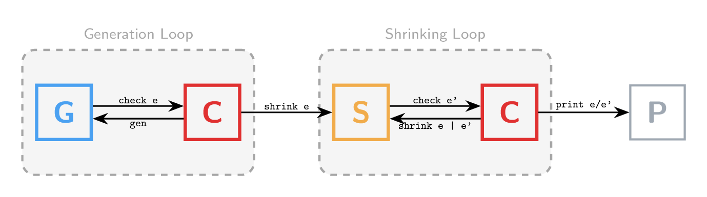
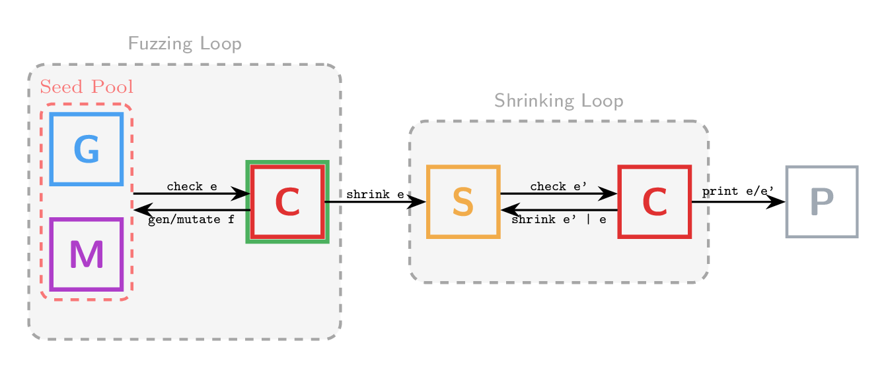
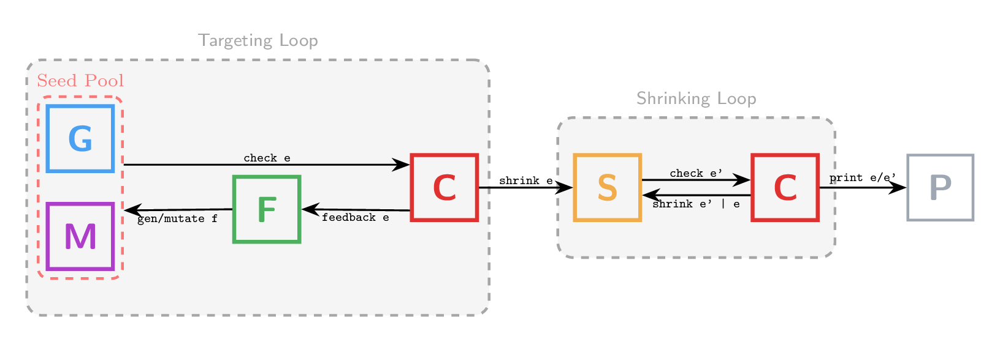
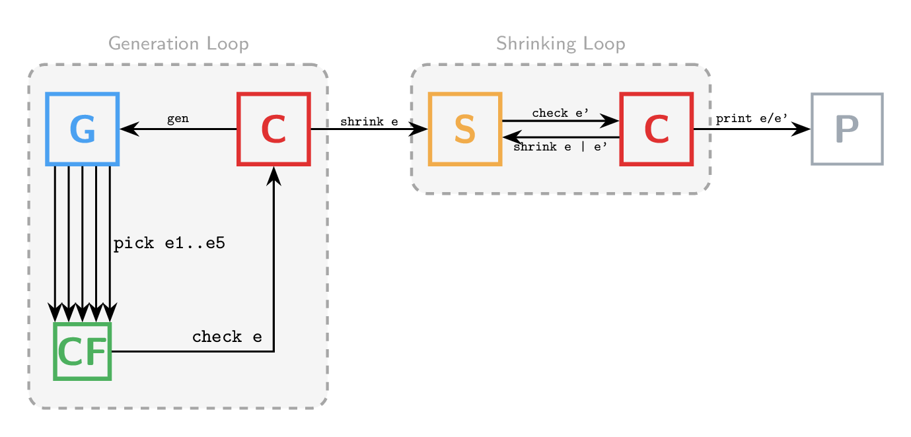
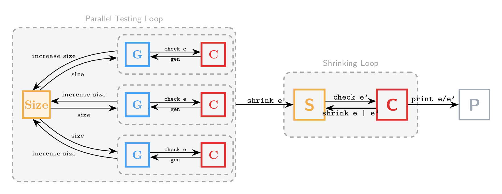

+++
title = "Programmable PBT"
description = "Creating a Flexible Property-Based Testing Paradigm"
weight = 1

[extra]
link_to = "/research/programmable_pbt"
+++

Property-based testing (PBT) frameworks provide two core components: a *property language* for writing executable specifications, and a *property runner* that tests them. Users can configure many aspects of the testing process -- hand-tuned generators, custom shrinkers, pretty printers, statistics collection -- but one thing they fundamentally cannot change is the property runner itself. The testing loop is baked into the framework.

This is a significant limitation, because there are many compelling reasons to change the testing loop. The PBT literature is full of alternative runner designs: coverage-guided fuzzing, targeted testing with user-defined feedback, integrated shrinking, combinatorial coverage, parallel execution. Each of these ideas has real practical value, but adopting any of them today means switching to an entirely different framework -- or writing one from scratch.

The root cause is a design decision shared by virtually all PBT frameworks since the original Haskell QuickCheck: properties are represented using a *shallow embedding* that makes them opaque to users. This is convenient for writing and running properties, but it means the property type is just a wrapper around a function, impossible to inspect, pattern match on, or reinterpret.

**Paper:** Programmable Property-Based Testing (under submission) | [PDF](/documents/dbas.pdf)

## The Problem: Shallow Embeddings Lock You In

Consider QuickCheck's property runner. It consists of two tight loops:



The **generation loop** repeatedly generates random inputs and checks them against the property until a counterexample is found (or a limit is reached). The **shrinking loop** then minimizes the counterexample by trying smaller inputs until a local minimum is reached.

Now consider what a coverage-guided fuzzing runner looks like:



The generation loop is replaced by a **fuzzing loop** that maintains a *seed pool* of interesting inputs, generates or mutates inputs based on the pool, and uses runtime feedback (e.g., branch coverage) to decide which inputs to keep. Despite the diagrams looking similar, these runners share almost no code in practice. Each has its own framework, its own property language, its own internal machinery.

The literature contains even more runner designs:



A **targeted runner** uses explicit user-defined feedback (not coverage) to guide generation. This has been used to find algorithmic complexity vulnerabilities and to maximize query plan diversity in SQL engines.



A **combinatorial runner** performs online generator thinning, generating several inputs per iteration and selecting those that maximize constructor coverage. This is particularly useful when test execution is expensive (e.g., compilers).



A **parallel runner** distributes generation across threads sharing a common atomic size counter, achieving near-linear speedups.

Each of these runners was implemented as a separate framework or a major redesign of an existing one. Users who want to try a different runner for their properties are out of luck unless they are willing to rewrite their test infrastructure.

## The Solution: Deferred Binding Abstract Syntax

The key insight is that the property language should be *decoupled* from the runner. Properties should be data structures that runners can interpret, not opaque functions that only one runner understands.

The approach is to use a novel style of mixed embedding called *deferred binding abstract syntax* (DBAS). In a shallow embedding, `forall` binds a variable using a host-language lambda -- convenient, but opaque. In DBAS, `forall` does *not* bind a variable at the binding site. Instead, the variable is bound at every *use site* (in the `check` clause). This seemingly odd choice is what makes properties inspectable: the argument to `forall` is no longer a function but a plain data structure that any runner can pattern match on and traverse.

In Rocq (using QuickChick), a DBAS property for optimization correctness looks almost identical to the shallow version:

```coq
Definition prop_eval :=
  ForAll e :- Expr,
  Check (fun 'e => eval e == eval (optimize e)).
```

Users can override specific aspects like the generator without changing anything else:

```coq
Definition prop_eval :=
  ForAll e :- Expr gen:gen,
  Check (fun 'e => eval e == eval (optimize e)).
```

In Racket, using macros to handle the plumbing, the surface syntax is equally clean:

```racket
(define eval-opt
  (property
    (forall e #:contract expr? #:gen gen-expr)
    (equal? (eval e) (eval (optimize e)))))
```

## Property Runners as User-Level Code

Once properties are data structures, writing a runner is just writing an interpreter. The generate-and-shrink runner becomes a straightforward recursive function over the property structure, using pluggable `generator`, `runner`, `shrinker`, and `printer` components.

This means all of the runner designs from the literature -- simple generational, coverage-guided fuzzing, targeted testing, combinatorial, parallel -- can be implemented as user-level code, without modifying the framework at all. The paper demonstrates this by implementing all six runner designs in both Rocq and Racket, and shows that the DBAS-based implementations have no observable performance overhead compared to their shallow counterparts.

### Simple Generational Runner

The simplest runner implements the classic QuickCheck-style generate-and-shrink loop. In Racket, the entire runner fits in a single function:

```racket
(define (run-loop tests p)
  (let loop ([n 0] [passed 0] [discards 0])
    (if (= n tests) (result #f passed discards #f)
      (let ([env (generate p run-rackcheck-gen (floor (log n 2)))])
        (case (check-property p env)
          [(fail) (result #t passed discards (shrink-eager p env))]
          [(pass) (loop (add1 n) (add1 passed) discards)]
          [(discard) (loop (add1 n) passed (add1 discards))])))))
```

The Rocq version is structurally identical, using `gen`, `run`, `shrinker`, and `print` as the four pluggable components that correspond directly to the boxes in the runner diagram above:

```coq
Definition runLoop (fuel : nat) (cprop : Prop ∅) :=
  let fix runLoop' (fuel : nat) (cprop : Prop ∅)
      (passed : nat) (discards: nat) : G Result :=
  match fuel with
  | O => ret (mkResult discards false passed [])
  | S fuel' =>
    input <- gen cprop (log2 (passed + discards));;
    res <- run cprop input ;;
    match res with
    | Normal seed false => (* Fails *)
      let shrunk := shrinker 10 cprop seed in
      let printed := print cprop 0 shrunk in
      ret (mkResult discards true (passed + 1) printed)
    | Normal _ true => (* Passes *)
      runLoop' fuel' cprop (passed + 1) discards
    | Discard _ _ =>   (* Discard *)
      runLoop' fuel' cprop passed (discards + 1)
    end
  end in
  runLoop' fuel cprop 0 0.
```

### Coverage-Guided Fuzzing Runner

The coverage-guided fuzzing runner replaces simple generation with a seed pool that tracks interesting inputs. At each iteration, the pool produces a directive -- either generate a fresh input or mutate a previous one. After execution, runtime feedback (e.g., branch coverage) determines whether to invest the input into the pool. The `SeedPool` interface abstracts away the search strategy and power schedule:

```coq
Definition fuzzLoop (fuel : nat) (cprop : Prop ∅) {Pool}
  {pool: SeedPool} (seeds : Pool) : G Result :=
  let fix fuzzLoop' (fuel passed discards: nat) seeds :=
  match fuel with
  | O => ret (mkResult discards false passed [])
  | S fuel' =>
    let directive := sample seeds in
    input <- match directive with
      | Generate => gen cprop (log2 (passed + discards))
      | Mutate source => mutate cprop source
    end;;
    res <- instrumentedRun cprop withInstrumentation;;
    let '(res, feedback) := res in
    match res with
    | Normal seed false => (* Fails *)
      let shrunk := shrinkLoop 10 cprop seed in
      let printed := print cprop 0 shrunk in
      ret (mkResult discards true (passed + 1) printed)
    | Normal seed true =>  (* Passes *)
      match useful seeds feedback with
      | true =>
        let seeds' := invest (seed, feedback) seeds in
        fuzzLoop' fuel' (passed + 1) discards seeds'
      | false =>
        let seeds' := match directive with
          | Generate => seeds
          | Mutate _ => revise seeds
        end in
        fuzzLoop' fuel' (passed + 1) discards seeds'
      end
    | Discard _ _ =>  (* Discard *)
      match directive with
      | Generate => fuzzLoop' fuel' passed (discards+1) seeds
      | Mutate source =>
        match useful seeds feedback with
        | true =>
          fuzzLoop' fuel' passed (discards+1) seeds
        | false =>
          fuzzLoop' fuel' passed (discards+1) (revise seeds)
        end
      end
    end
  end in
  fuzzLoop' fuel 0 0 seeds.
```

The key operations on the seed pool -- `sample`, `invest`, `revise`, and `useful` -- are all user-configurable through the `SeedPool` interface. This means users can swap in different search strategies (random selection, round-robin, energy-based scheduling) without touching the runner code at all.
